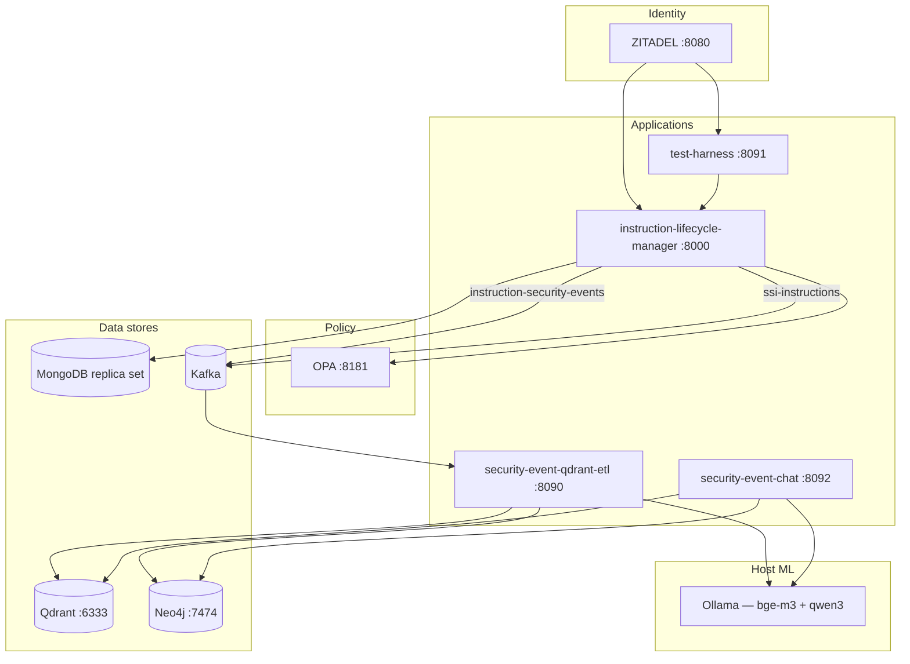
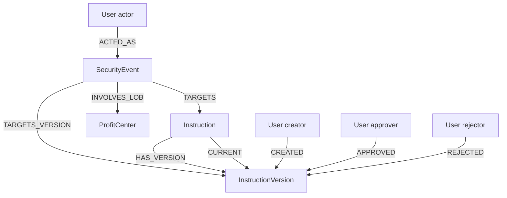
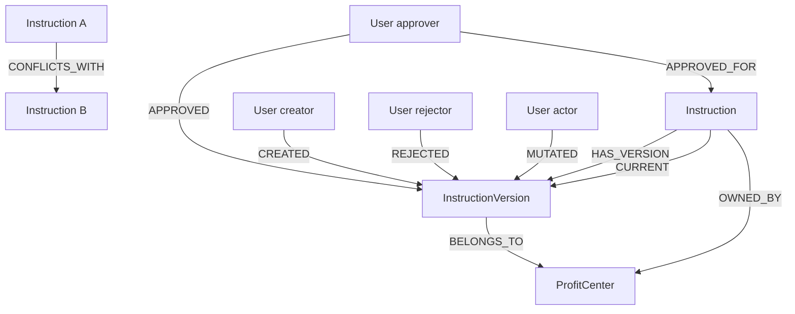

# Security Event RAG Demo

A monorepo demonstrating how to build a **retrieval-augmented generation (RAG) system over financial security events** using a fully local, containerized stack.

The domain is **Security Settlement Instructions** in a capital-markets middle-office context. Every instruction mutation — create, submit, approve, reject, suspend, reactivate — is recorded as a structured security event, streamed through Kafka, indexed into Qdrant and Neo4j, and made queryable via a natural-language chat interface powered by a local Ollama LLM.

## Demo questions

The chat is designed to surface **fraud patterns, compliance violations, and collusion signals** — questions that go beyond what a standard application status screen can answer.

**Collusion and mutual approval:**
- _Are there any instances of approving each other's instructions?_
- _Has any user attempted to approve an instruction they originally created?_

**Inversion of control — segregation of duties:**
- _Are there any instructions approved by someone who directly reports to the instruction's creator?_

> Banks enforce a hierarchy rule: a subordinate must not approve their manager's instruction. This is an inversion of control violation — the approval authority flows the wrong way up the reporting chain.

**Compliance investigation:**
- _Who created the instruction that Michael Torres rejected?_
- _Show me all ALERT events for FICC instructions in the last 7 days._
- _Which users triggered the most policy denial alerts this week?_

**Duplicate and conflicting routes:**
- _Are there active instructions sharing the same creditor account and currency — potential duplicate settlement routes?_

**Exact event and instruction lookup:**
- _Can you show me the instruction associated with security event id `<uuid>`?_
- _Can you show me the full lifecycle timeline of instruction `<uuid>`?_

---

## Architecture



### Data flow

1. **ILM** — operator creates/mutates an instruction; ZITADEL JWT is validated; OPA authorizes the action; instruction version and security event are written to MongoDB **in a single transaction**; two Kafka fact events are published — one to `instruction-security-events` (security event + full instruction snapshot) and one to `ssi-instructions` (instruction state fact).
2. **ETL** — runs two independent Kafka consumers. The **SecurityEventPipeline** consumes `instruction-security-events` and upserts a Neo4j security-event subgraph and a Qdrant hybrid point tagged `source=security_event`. The **InstructionPipeline** consumes `ssi-instructions` and upserts the instruction master graph in Neo4j and a Qdrant point tagged `source=instruction_state`. Both pipelines are **self-contained** — every fact event carries the full instruction snapshot, so no API callbacks to the ILM are needed.
3. **Chat** — on every user question, selects a retrieval mode (`events` / `instructions` / `both`), runs three retrievers in parallel (Qdrant vector + BM25 filtered by source tag, Ollama-generated Cypher → Neo4j), merges results with reciprocal rank fusion, and synthesises a natural-language answer with Ollama. When the question contains a UUID, the pipeline also performs a deterministic exact lookup in both stores.

---

### Why MongoDB for security events?

Security events are **write-heavy, append-only, and schema-flexible**. Different event actions (CREATE, APPROVE, REJECT, VIEW) carry different payloads — a rejection includes a reason, an approval includes the approver's LOB, a VIEW includes a resource path. A fixed relational schema would require either nullable columns for every possible field or a separate table per event type, both of which complicate queries.

MongoDB fits naturally because:

- **Schemaless documents** — each event is stored as-is with no schema migration when new fields are added. New event types or enrichment fields can be introduced without downtime.
- **Long-term retention** — MongoDB's native **TTL indexes** allow per-collection expiry policies. Security events for regulatory audit trails can be retained for years on cheap storage (or tiered to Atlas Online Archive), while transient operational events expire automatically. A single `db.createIndex({"timestamp": 1}, {expireAfterSeconds: N})` declaration governs the lifecycle.
- **Bi-temporal versioning** — instructions are stored as versioned documents (`version_number`, `in`/`out` timestamps). MongoDB's document model stores the entire version as a self-contained snapshot alongside its lifecycle metadata without JOIN complexity.
- **Change Streams** — the ILM's live security-event monitor and the `SecurityEventWatcher` for real-time UI updates both consume MongoDB Change Streams, which provide ordered, resumable change feeds without an external CDC layer.
- **Replica set transactions** — writing an instruction version and its security event in a single ACID multi-document transaction requires a MongoDB replica set, which `docker-compose.yml` initialises automatically as `rs0`.

---

### Why Kafka?

Every instruction mutation produces a **security event** — a structured audit record of who did what to which instruction and when. Kafka decouples the producers of those events (ILM) from every consumer that needs them.

Key reasons:

- **Fan-out with no coupling** — any new consumer (compliance reporting tool, real-time fraud detector, ML feature pipeline, a second ETL feeding a different vector store) can subscribe to the `security-events` topic independently without any change to the ILM. The ILM publishes once; consumers scale independently.
- **Durable replay** — Kafka retains events on disk for a configurable retention window. If the ETL falls behind, restarts, or needs to reprocess a backfill, it can seek back to any offset and replay without touching the ILM.
- **Ordered delivery per partition** — events for the same instruction arrive in order, which matters for the ETL's `CURRENT` relationship management in Neo4j (it only promotes a new version if its `version_number` is higher than the current one).
- **Backpressure isolation** — a spike in instruction activity does not block the ILM. The ETL processes at its own pace; the Kafka topic absorbs the burst.

In this demo Kafka runs as a single broker with no replication, which is appropriate for local development. A production deployment would use a multi-broker cluster with `replication.factor=3` and `min.insync.replicas=2`.

---

### Why ZITADEL?

**What ZITADEL is:** ZITADEL is an open-source cloud-native identity and access management (IAM) platform — think self-hosted Auth0 or Okta. It provides OIDC/OAuth2 authentication, JWT issuance, user management, and metadata storage. In this demo it runs entirely in Docker with no external dependencies.

**How ZITADEL is used:**

Every request to the ILM carries a ZITADEL-issued JWT Bearer token. The ILM validates it against ZITADEL's OIDC discovery endpoint (`/.well-known/openid-configuration`) and extracts the caller's identity — user ID, roles, LOB, and reporting line — from ZITADEL user metadata:

| Metadata key | Meaning | Used for |
|---|---|---|
| `subject_user_id` | Business user ID (`mo-100`, `ficc-300`) | Security events, graph nodes |
| `given_name` / `family_name` | Full name | `display_name` in graph + chat answers |
| `title` | Seniority (Analyst / VP / MD) | OPA approval matrix |
| `roles` | JSON array (`INSTRUCTION_CREATOR`, `INSTRUCTION_APPROVER`) | OPA role check |
| `lob` | Owning profit center (FICC, FX, DESK_*) | OPA LOB ownership check |
| `supervisor_id` | Direct manager's user ID | Inversion-of-control detection in graph |

This metadata is stored in ZITADEL via the `zitadel-seed/seed.py` script, which reads `users.yaml` and calls the ZITADEL admin API to create users and attach metadata. The ILM decodes and validates this metadata on every authenticated request.

**Why ZITADEL over a simpler alternative:** ZITADEL provides a **user metadata API** that allows arbitrary key-value pairs per user (roles, LOB, supervisor). This means identity attributes that drive authorization policy (LOB ownership, seniority, org hierarchy) live in the identity layer — not hard-coded in the application or duplicated across services. Any service that validates the JWT can read the same canonical user attributes without a separate user-profile API call.

---

### Why OPA?

**What OPA is:** Open Policy Agent is a **policy-as-code** engine. It decouples authorization decisions from application code — the application sends a structured query (`input`) to OPA and receives a boolean decision (allow / deny). Policies are written in **Rego**, a declarative language designed for hierarchical data queries.

**How OPA is used:**

Before every instruction mutation, the ILM submits a structured authorization query to OPA:

```json
{
  "input": {
    "action": "APPROVE",
    "subject": { "user_id": "mo-100", "title": "Analyst", "roles": ["INSTRUCTION_CREATOR"], "lob": null },
    "resource": { "instruction_id": "...", "owning_lob": "FICC", "created_by": "mo-100", "status": "PENDING" }
  }
}
```

OPA evaluates the Rego policy bundle and returns `{"result": {"allow": false, "reason": "creator cannot approve their own instruction"}}`. The ILM then either proceeds or emits a **policy denial security event** (severity `ALERT`) to Kafka.

**Key policies enforced:**

| Rule | Rego condition | What it catches |
|---|---|---|
| Role gate | `"INSTRUCTION_APPROVER" in subject.roles` | Non-approvers attempting to approve |
| Creator cannot approve | `subject.user_id != resource.created_by` | Self-approval (cross-approval collusion) |
| LOB ownership | `subject.lob == resource.owning_lob` | Wrong-desk approval (e.g. FX desk approving FICC instruction) |
| Status gate | `resource.status == "PENDING"` | Approving an instruction not yet submitted |
| Role segregation | `"INSTRUCTION_CREATOR" not in subject.roles` | Middle-office creator accounts cannot approve |

**Why policy-as-code matters for this demo:** Every OPA denial becomes an `ALERT`-severity security event in Kafka → Neo4j → Qdrant. The RAG chat can then surface patterns like _"which users triggered the most policy denial alerts?"_ or _"has anyone attempted to approve their own instruction?"_ — questions that only make sense if the policy engine is generating a structured, queryable audit trail rather than just returning 403.

**Why OPA over embedding auth in the ILM:** Policy logic changes independently of application logic. Adding a new rule (e.g. "MD-level approval required for international wire > $10M") requires editing a `.rego` file and reloading OPA — not rebuilding and redeploying the ILM. The `opa-policy-seed` container loads policies from the `opa-policy-seed/policies/` directory at startup.

---

### Why Qdrant + BM25 (hybrid search)?

No single retrieval strategy reliably handles the full range of questions a user asks over security events.

**Dense vector search** (via `bge-m3` embeddings) excels at **semantic similarity** — "who tried to approve each other's instructions?" or "show me policy denial events for FX desk" — where the meaning matters more than the exact words. But dense search struggles with **exact identifiers**: if the user pastes a UUID like `2f75858d-d845-40d4-b9fb-43951a8c40e2`, the embedding of that string carries little semantic signal and the cosine similarity ranking is unreliable.

**BM25 sparse search** is a classical term-frequency model (the same family as Elasticsearch's default scorer). It excels precisely where dense search fails: **exact-match tokens** — UUIDs, user IDs (`mo-100`, `ficc-300`), action names (`APPROVE`, `REJECT`), currency codes (`USD`, `EUR`). However, BM25 has no concept of synonymy or paraphrase — "declined" and "rejected" are unrelated tokens to BM25.

**Hybrid search** fuses both signals:

```
score_hybrid(doc) = RRF(rank_dense, rank_bm25)
                  = 1/(k + rank_dense) + 1/(k + rank_bm25)
```

Reciprocal Rank Fusion (RRF, Cormack et al. 2009) combines ranked lists without requiring score normalisation. The constant `k=60` dampens the influence of very high ranks. Empirically, hybrid search consistently outperforms either retriever alone in recall@10 across heterogeneous query distributions — a result confirmed in the BEIR benchmark suite and Qdrant's own evaluations.

Qdrant was chosen because it natively supports **named vectors** (one point can carry both a dense 1024-d float32 vector and a BM25 sparse vector), runs hybrid queries server-side, and exposes a clean async Python client. The BM25 sparse encoder (`qdrant/bm25`) runs inside Qdrant itself — no separate sparse-encoder service is needed.

---

### Why Neo4j (knowledge graph)?

The fundamental limitation of vector + BM25 retrieval is that it operates over **flat document similarity**. Each enriched security event is an independent point in the index. Relationships between events — "this approval was done by the same person who created the other instruction", "these two instructions share a creditor account and currency, suggesting a duplicate route" — are **invisible** to a retriever that ranks documents one at a time.

A **knowledge graph** makes those relationships first-class queryable citizens:

```
(User ficc-300)-[:APPROVED]->(InstructionVersion v2)
(User mo-100)-[:CREATED]->(InstructionVersion v2)
(User ficc-300)-[:APPROVED_FOR]->(User mo-100)   ← cross-approval edge
```

The graph enables questions that are **structurally impossible** with flat retrieval alone:

| Question | Why flat retrieval fails | How Neo4j answers it |
|---|---|---|
| Are there users who approved each other's instructions? | Would require joining two separate query results and checking for symmetry | `MATCH (a)-[:APPROVED_FOR]->(b), (b)-[:APPROVED_FOR]->(a)` |
| What is the full lifecycle timeline of instruction X? | Each event is a separate document — reassembling order requires post-processing | `MATCH (e)-[:TARGETS]->(i) ORDER BY e.timestamp` |
| Which instructions share the same creditor account? | No link exists between documents for separate instructions | `MATCH (v1)-[:CONFLICTS_WITH]->(v2)` |
| Who are all the users in the FICC profit center? | Would need keyword search on `lob=FICC` and hope the field is indexed | `MATCH (u)-[:BELONGS_TO]->(p:ProfitCenter {lob: 'FICC'})` |

**Role in improving RAG recall:**

The chat pipeline asks Ollama to generate a Cypher query for every user question. That query runs against Neo4j and returns structured rows (event IDs, user IDs, instruction IDs, timestamps). Those rows are injected into the LLM context alongside the vector and BM25 results. The LLM then synthesises an answer that combines semantic context (from vector search) with precise relational facts (from the graph). Neither source alone would produce a complete, accurate answer for relationship-heavy questions.

The graph also serves as a **cross-validation layer**: if a UUID is present in the question, the pipeline runs a deterministic Cypher lookup (`MATCH (e:SecurityEvent {event_id: $id})-[:TARGETS_VERSION]->(v)`) that is guaranteed to be exact regardless of embedding similarity.

---

### Why Ollama? Why run it on the host?

**What Ollama is:** Ollama is an open-source LLM serving runtime that packages model weights, quantisation, and an HTTP API (`/api/embed`, `/api/chat`) into a single binary. It supports Metal (Apple GPU), CUDA (NVIDIA GPU), and CPU backends and exposes an OpenAI-compatible interface.

**Why run Ollama on the host, not in Docker:** Docker on macOS runs containers inside a Linux VM (via Apple Hypervisor Framework). That VM has **no visibility into the host GPU** — neither Metal nor MPS (Metal Performance Shaders) is accessible from within a Docker container on macOS. Running `ollama` natively on the host means it can use the Apple M1 Max GPU directly via Metal, achieving 4–8× the inference throughput of CPU-only mode. The containers reach the host Ollama instance via `host.docker.internal:11434`.

**Model selection — embedding:**

| Model | Dim | Context | Strengths | Why not used here |
|---|---|---|---|---|
| `bge-m3:latest` ✓ | 1024 | 8192 | Multilingual, unified dense+sparse+multi-vector, financial text | — |
| `nomic-embed-text` | 768 | 8192 | Fast, small, good English recall | Lower dimension, English-only |
| `mxbai-embed-large` | 1024 | 512 | Strong English MTEB scores | Very short context window |
| `text-embedding-3-small` (OpenAI) | 1536 | 8191 | High quality | Requires API key, not local |

`bge-m3` was selected for its **8192-token context window** (security event documents with full instruction payloads can be long), its **multilingual capability**, and the fact that it is the only open model that natively supports dense, sparse, and multi-vector retrieval from a single forward pass.

**Model selection — LLM (Cypher generation + answer synthesis):**

| Model | Params | Context | Cypher quality | Notes |
|---|---|---|---|---|
| `qwen3:30b` ✓ | 30B | 32 768 | Excellent | Strong structured output, handles complex schema |
| `llama3.1:8b` | 8B | 128 000 | Good | Fast, lower quality Cypher for multi-hop queries |
| `mistral:7b` | 7B | 32 768 | Fair | Tends to hallucinate relationship directions |
| `codellama:13b` | 13B | 16 384 | Good | Strong on code but weaker on natural-language synthesis |
| `llama3.3:70b` | 70B | 128 000 | Excellent | Too large for M1 Max 64 GB at full precision |
| `gemma3:27b` | 27B | 128 000 | Very good | Competitive alternative to qwen3:30b |

`qwen3:30b` was selected because it fits comfortably in 64 GB unified memory at 4-bit quantisation (~19 GB), consistently generates correct Cypher for multi-hop graph queries (including `OPTIONAL MATCH` chains and `coalesce` expressions), and produces well-structured natural-language answers that correctly cite event IDs and user names.

> To swap models: `OLLAMA_CHAT_MODEL=gemma3:27b` (or any model pulled via `ollama pull`).

---

### Test hardware

All models and benchmarks in this demo were run on the following hardware:

| Component | Specification |
|---|---|
| Chip | Apple M1 Max |
| Unified RAM | 64 GB |
| GPU cores | 32 (built-in, Metal 3) |
| GPU vendor | Apple (0x106b) |
| GPU bus | Built-in (unified memory — no PCIe transfer overhead) |
| Metal support | Metal 3 |

The unified memory architecture means the CPU, GPU, and Neural Engine share the same 64 GB pool with no PCIe copy overhead between host and device memory. This is particularly advantageous for LLM inference: `qwen3:30b` at Q4_K_M quantisation (~19 GB) fits entirely in GPU-accessible memory, achieving approximately **25–35 tokens/second** generation throughput on the 32-core GPU via Ollama's Metal backend.

Embedding throughput with `bge-m3` is approximately **80–120 documents/second** for typical security event document lengths, which is sufficient for real-time ETL indexing at the event rates generated by this demo.

---

## Services

| URL | Service | Purpose |
|-----|---------|---------|
| http://localhost:8000/ui/ | ILM | Instruction browser |
| http://localhost:8000/ui/security-events/ | ILM | Live security event monitor (SSE) |
| http://localhost:8000/docs | ILM | OpenAPI |
| http://localhost:8090 | ETL | Search console — vector / BM25 / hybrid / Neo4j |
| http://localhost:8091 | Test harness | Generate lifecycle traffic |
| http://localhost:8092 | Chat | Natural-language Q&A |
| http://localhost:7474/browser/ | Neo4j | Graph browser — `neo4j` / `devpassword` |
| http://localhost:8080 | ZITADEL | Identity provider |

---

## Components

| Directory | Role |
|-----------|------|
| `instruction-lifecycle-manager` | FastAPI lifecycle API — OPA authorization, Mongo persistence (bi-temporal versioning), Kafka security event publishing, instruction and security event UIs |
| `security-event-qdrant-etl` | Dual Kafka consumers — SecurityEventPipeline (`instruction-security-events`) + InstructionPipeline (`ssi-instructions`) → Neo4j graph writer + Qdrant hybrid indexer (two point types) + search console UI |
| `security-event-chat` | RAG chat — triple retrieval (vector + BM25 + Cypher), RRF merge, Ollama answer synthesis |
| `security-event-test-harness` | ZITADEL-authenticated browser UI to drive create → submit → approve / reject lifecycles |
| `neo4j-graph-model` | Graph schema docs, Cypher constraints/indexes, example queries |
| `opa-policy-seed` | Rego policies — approval matrix, LOB ownership, role checks |
| `zitadel-seed` | Demo user seed (`users.yaml`) — middle office + FICC/FX/DESK approvers + ETL service account |
| `log-forwarder` | Optional container log shipping to Kafka |

---

## Models

### Embedding model — `bge-m3:latest`

The ETL and Chat use [BAAI/BGE-M3](https://huggingface.co/BAAI/bge-m3) served via Ollama for dense vector embeddings.

| Property | Value |
|----------|-------|
| Model | `bge-m3:latest` |
| Provider | BAAI (Beijing Academy of AI) |
| Architecture | XLM-RoBERTa-based encoder |
| Output dimension | **1024** float32 |
| Context window | 8192 tokens |
| Strengths | Multilingual (100+ languages), strong on domain-specific financial text, unified dense + sparse + multi-vector |

BGE-M3 is queried through `POST /api/embed` on the local Ollama instance. Each security event document is embedded at write time by the ETL and at query time by the Chat for similarity search.

### Sparse retrieval — `qdrant/bm25`

Alongside dense vectors, both the ETL indexer and Chat retriever use Qdrant's built-in **BM25** sparse encoder (`qdrant/bm25`). BM25 is a classical term-frequency retrieval model — it complements dense semantic search by excelling at exact-match terms like UUIDs, user IDs (`mo-100`, `ficc-300`), and action names (`APPROVE`, `REJECT`).

### Chat / answer model — `qwen3:30b`

The LLM used for Cypher generation and answer synthesis is [Qwen3-30B](https://huggingface.co/Qwen/Qwen3-30B) served via Ollama.

| Property | Value |
|----------|-------|
| Model | `qwen3:30b` (default, configurable via `OLLAMA_CHAT_MODEL`) |
| Provider | Alibaba Cloud — Qwen team |
| Architecture | Dense transformer, Mixture-of-Experts variant |
| Parameters | 30B |
| Context window | 32 768 tokens |
| Strengths | Strong code and structured output generation (Cypher), instruction following, multilingual |

The model is called twice per user question:
1. **Cypher generation** — `CYPHER_SYSTEM_PROMPT` + schema + question → a read-only Neo4j Cypher query
2. **Answer synthesis** — `ANSWER_SYSTEM_PROMPT` + retrieved context → a natural-language answer with event IDs, actors, and LOB attribution

Both calls are made via `POST /api/chat` on the local Ollama instance with `stream: false`.

> To use a different chat model: `OLLAMA_CHAT_MODEL=llama3.1:8b` (or any model pulled via `ollama pull`).

---

## Prerequisites

| Requirement | Notes |
|-------------|-------|
| Docker + Docker Compose | All containers are defined in `docker-compose.yml` |
| [Ollama](https://ollama.com) running on the host | Needed by ETL and Chat; containers reach it via `host.docker.internal:11434` |
| `bge-m3:latest` model pulled | `ollama pull bge-m3:latest` |
| A chat model pulled | Default: `qwen3:30b` — `ollama pull qwen3:30b` (substitute any model via `OLLAMA_CHAT_MODEL`) |

---

## Quick start

```bash
# 1. Pull Ollama models on the host
ollama pull bge-m3:latest
ollama pull qwen3:30b       # or any chat model you prefer

# 2. Start the full stack
docker compose up -d

# 3. Seed demo users (after ZITADEL has initialised — ~30 s)
PAT=$(docker exec zitadel-login cat /zitadel/bootstrap/login-client.pat | tr -d '\n')
cd zitadel-seed && ZITADEL_PAT="$PAT" python3 seed.py

# 4. Open the test harness and generate some lifecycle traffic
open http://localhost:8091

# 5. Open the chat and start asking questions
open http://localhost:8092
```

### Reset everything

```bash
docker compose down -v --remove-orphans
docker compose up -d
# re-seed ZITADEL users as above
```

---

## Demo users

All passwords are `Password1!`. Login names follow `{user_id}@ssi.local`.

| User | Name | Role | LOB |
|------|------|------|-----|
| `mo-100` | Sarah Chen | Analyst — middle office creator | — |
| `mo-101` | James Patel | Analyst — middle office creator | — |
| `mo-050` | David Okonkwo | VP — middle office creator | — |
| `mo-010` | Patricia Walsh | MD — middle office creator | — |
| `ficc-201` | Michael Torres | Associate — approver | FICC |
| `ficc-300` | Elena Vasquez | VP — approver | FICC |
| `ficc-400` | Robert Kim | MD — approver | FICC |
| `ficc-500` | Caroline Nguyen | Partner — approver | FICC |
| `fx-201` | Amira Hassan | Associate — approver | FX |
| `fx-300` | Lucas Berger | VP — approver | FX |
| `rates-201` | Nina Johansson | Associate — approver | DESK_RATES |
| `etl-reader` | — | Service account — excluded from security event emission (`SECURITY_EVENT_EXCLUDED_USER_IDS`) | — |

---

## Instruction model

An **instruction** is an **SSI settlement route template** — accounts, agent chain, currency, and validity. It is **not** a payment message; no amount, value date, or remittance information lives here.

```
instruction_type    STANDING | SINGLE_USE
wire_scope          DOMESTIC | INTERNATIONAL
currency            ISO 4217 (e.g. USD, EUR)
funding_account     source account
debtor / creditor   legal entities
*_agent             bank chain (ABA / BIC / CHIPS)
effective_date      template validity start
end_date            template validity end
```

Lifecycle: `DRAFT` → `PENDING` → `STANDING | SINGLE_USE` or `REJECTED` → `SUSPENDED` → reactivated or `USED`.

---

## Neo4j graph model

Two ETL pipelines write to the **same Neo4j database**, producing two complementary sub-graphs that share nodes (`Instruction`, `InstructionVersion`, `User`, `ProfitCenter`).

### Graph 1 — Security Event Graph
Built by `SecurityEventPipeline` from the `instruction-security-events` topic.
Answers: _who triggered this event, what severity, what instruction was touched, which actor caused a policy denial?_



### Graph 2 — Instruction Master Graph
Built by `InstructionPipeline` from the `ssi-instructions` topic.
Answers: _what is the current state of an instruction, who approved it, are there duplicate settlement routes, did a subordinate approve their manager's instruction?_



The `CURRENT` relationship is **version-aware** — it only advances forward and is never overwritten by an older version arriving out of order.

Because the two graphs share nodes, cross-graph queries work naturally:

```cypher
-- ALERT event actor + current instruction state in one query
MATCH (actor:User)-[:ACTED_AS]->(e:SecurityEvent {severity: 'ALERT'})
MATCH (e)-[:TARGETS_VERSION]->(v:InstructionVersion)
MATCH (i:Instruction {instruction_id: v.instruction_id})-[:CURRENT]->(cv:InstructionVersion)
RETURN actor.display_name, e.message, cv.status, cv.owning_lob
ORDER BY e.timestamp DESC LIMIT 20;

-- Full lifecycle timeline of an instruction (from instruction master graph)
MATCH (i:Instruction {instruction_id: $uuid})-[:HAS_VERSION]->(v:InstructionVersion)
OPTIONAL MATCH (actor:User)-[:MUTATED]->(v)
RETURN v.version_number, v.action, v.status, v.timestamp,
       coalesce(actor.display_name, actor.user_id) AS actor
ORDER BY v.version_number ASC LIMIT 50;

-- Mutual approval (collusion signal)
MATCH (a:User)-[:APPROVED]->(va:InstructionVersion)<-[:CREATED]-(b:User)
MATCH (b)-[:APPROVED]->(vb:InstructionVersion)<-[:CREATED]-(a)
WHERE a.user_id <> b.user_id
RETURN a.display_name AS user_a, b.display_name AS user_b,
       va.instruction_id AS approved_by_a, vb.instruction_id AS approved_by_b;

-- Potential duplicate settlement routes
MATCH (i1:Instruction)-[:CONFLICTS_WITH]->(i2:Instruction)
MATCH (i1)-[:CURRENT]->(v1:InstructionVersion)
MATCH (i2)-[:CURRENT]->(v2:InstructionVersion)
RETURN v1.instruction_id, v1.creditor_account, v1.currency, v2.instruction_id
LIMIT 50;
```

See `neo4j-graph-model/` for the full property catalog and schema.

---

## RAG pipeline detail

```
User question
│
├─ UUID detected? ──► Exact Qdrant fetch + fixed Neo4j lookup (pinned to top of context)
│
├─► Qdrant dense vector search (bge-m3)
├─► Qdrant BM25 sparse search
└─► Ollama → Cypher → Neo4j
         │
         ▼
    RRF merge (k=60) + dedupe by event_id
         │
         ▼
    Ollama chat synthesis
```

The chat API response includes the generated Cypher query, graph rows, per-source timing, and source cards tagged `vector` / `bm25` / `neo4j` / `exact`.

---

## Transactional consistency

Every instruction mutation (create, update, submit, approve, reject, suspend, reactivate, use, delete) writes:

- the instruction version to `ssi_cash_instructions.instructions`
- the matching security event to `security_events.instruction-lifecycle-manager`

in a **single MongoDB multi-document transaction**. Kafka publish happens only after the transaction commits. MongoDB must run as a replica set — `docker-compose.yml` initialises `rs0` automatically.

---

## Local development

```bash
# ILM API
cd instruction-lifecycle-manager && pip install -e .
uvicorn instruction_lifecycle_manager.main:app --reload --port 8000

# ETL + search console
cd security-event-qdrant-etl && pip install -e .
security-event-search           # :8090

# Chat
cd security-event-chat && pip install -e .
security-event-chat             # :8092

# Test harness
cd security-event-test-harness && pip install -e .
security-event-test-harness-ui  # :8091
```

Each service reads configuration from environment variables (see its own README for the full list). Requires local MongoDB, Kafka, Qdrant, Neo4j, OPA, ZITADEL, and Ollama.

---

## Repository layout

```
.
├── docker-compose.yml
├── instruction-lifecycle-manager/   # ILM API + instruction / security UIs
├── security-event-qdrant-etl/       # Kafka ETL + search console
├── security-event-chat/             # RAG chat
├── security-event-test-harness/     # E2E test harness UI
├── neo4j-graph-model/               # Graph schema and example queries
├── opa-policy-seed/                 # Rego policies
├── zitadel-seed/                    # Demo user definitions
└── log-forwarder/                   # Optional log → Kafka forwarder
```

Each application directory has its own README.

---
