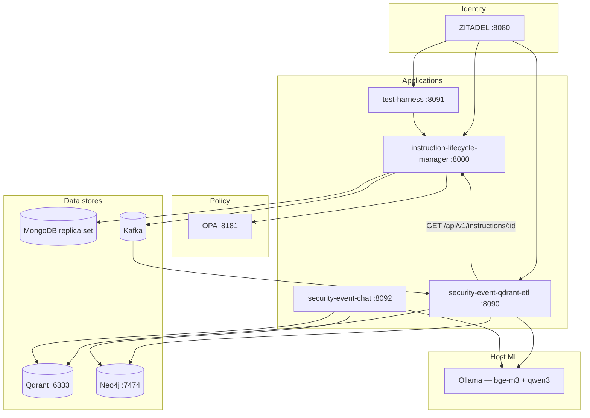
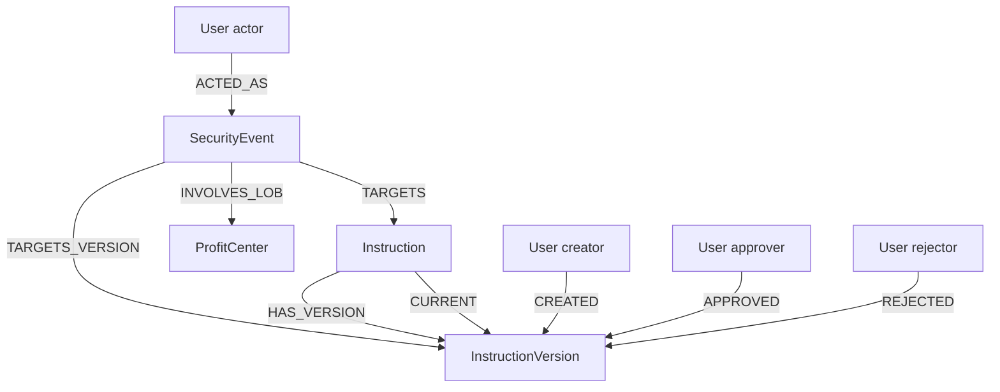
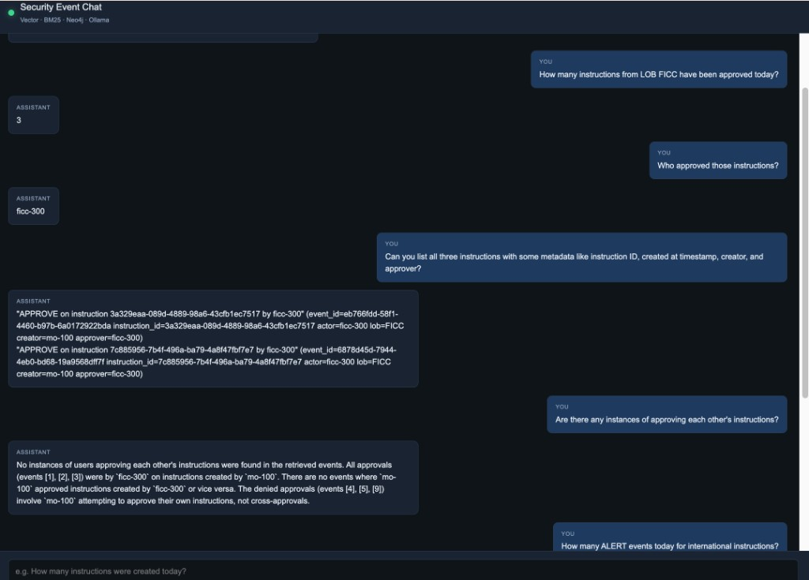

# Security Event RAG Demo

A monorepo demonstrating how to build a **retrieval-augmented generation (RAG) system over financial security events** using a fully local, containerized stack.

The domain is **SSI settlement route template** lifecycle management in a capital-markets middle-office context. Every instruction mutation — create, submit, approve, reject, suspend, reactivate — is recorded as a structured security event, streamed through Kafka, indexed into Qdrant and Neo4j, and made queryable via a natural-language chat interface powered by a local Ollama LLM.

## Demo questions

Ask the chat interface things like:

- _Are there any instances of approving each other's instructions?_
- _Who created the instruction that Michael rejected?_
- _How many instructions were created today?_
- _How many ALERT events today for international instructions?_
- _Are there instructions created today still waiting for approval?_
- _Can you show me the instruction associated with security event id `<uuid>`?_

---

## Architecture



### Data flow

1. **ILM** — operator creates/mutates an instruction; OPA authorizes the action; instruction version and security event are written to MongoDB **in a single transaction**; the event is published to Kafka.
2. **ETL** — consumes each Kafka event, authenticates as service user `etl-reader`, fetches the current instruction from ILM API, builds a merged enriched document, upserts a Neo4j graph node/relationships and a Qdrant hybrid point (dense + BM25).
3. **Chat** — on every user question, runs three retrievers in parallel (Qdrant vector, Qdrant BM25, Ollama-generated Cypher → Neo4j), merges results with reciprocal rank fusion, and synthesises a natural-language answer with Ollama. When the question contains a UUID, the pipeline also performs a deterministic exact lookup in both stores.

**Loop prevention:** ILM suppresses security event emission for `etl-reader` via `SECURITY_EVENT_EXCLUDED_USER_IDS` so ETL enrichment reads never re-trigger Kafka.

---

## Services

| URL | Service | Purpose |
|-----|---------|---------|
| http://localhost:8000/ui/ | ILM | Instruction browser |
| http://localhost:8000/ui/security-events/ | ILM | Live security event monitor (SSE) |
| http://localhost:8000/docs | ILM | OpenAPI |
| http://localhost:8090 | ETL | Search console — vector / BM25 / hybrid / Neo4j |
| http://localhost:8091 | Test harness | Generate lifecycle traffic |
| http://localhost:8092 | Chat | Natural-language Q&A |
| http://localhost:7474/browser/ | Neo4j | Graph browser — `neo4j` / `devpassword` |
| http://localhost:8080 | ZITADEL | Identity provider |

---

## Components

| Directory | Role |
|-----------|------|
| `instruction-lifecycle-manager` | FastAPI lifecycle API — OPA authorization, Mongo persistence (bi-temporal versioning), Kafka security event publishing, instruction and security event UIs |
| `security-event-qdrant-etl` | Kafka consumer — enrich events via ILM API → Neo4j graph writer + Qdrant hybrid indexer + search console UI |
| `security-event-chat` | RAG chat — triple retrieval (vector + BM25 + Cypher), RRF merge, Ollama answer synthesis |
| `security-event-test-harness` | ZITADEL-authenticated browser UI to drive create → submit → approve / reject lifecycles |
| `neo4j-graph-model` | Graph schema docs, Cypher constraints/indexes, example queries |
| `opa-policy-seed` | Rego policies — approval matrix, LOB ownership, role checks |
| `zitadel-seed` | Demo user seed (`users.yaml`) — middle office + FICC/FX/DESK approvers + ETL service account |
| `log-forwarder` | Optional container log shipping to Kafka |

---

## Models

### Embedding model — `bge-m3:latest`

The ETL and Chat use [BAAI/BGE-M3](https://huggingface.co/BAAI/bge-m3) served via Ollama for dense vector embeddings.

| Property | Value |
|----------|-------|
| Model | `bge-m3:latest` |
| Provider | BAAI (Beijing Academy of AI) |
| Architecture | XLM-RoBERTa-based encoder |
| Output dimension | **1024** float32 |
| Context window | 8192 tokens |
| Strengths | Multilingual (100+ languages), strong on domain-specific financial text, unified dense + sparse + multi-vector |

BGE-M3 is queried through `POST /api/embed` on the local Ollama instance. Each security event document is embedded at write time by the ETL and at query time by the Chat for similarity search.

### Sparse retrieval — `qdrant/bm25`

Alongside dense vectors, both the ETL indexer and Chat retriever use Qdrant's built-in **BM25** sparse encoder (`qdrant/bm25`). BM25 is a classical term-frequency retrieval model — it complements dense semantic search by excelling at exact-match terms like UUIDs, user IDs (`mo-100`, `ficc-300`), and action names (`APPROVE`, `REJECT`).

### Chat / answer model — `qwen3:30b`

The LLM used for Cypher generation and answer synthesis is [Qwen3-30B](https://huggingface.co/Qwen/Qwen3-30B) served via Ollama.

| Property | Value |
|----------|-------|
| Model | `qwen3:30b` (default, configurable via `OLLAMA_CHAT_MODEL`) |
| Provider | Alibaba Cloud — Qwen team |
| Architecture | Dense transformer, Mixture-of-Experts variant |
| Parameters | 30B |
| Context window | 32 768 tokens |
| Strengths | Strong code and structured output generation (Cypher), instruction following, multilingual |

The model is called twice per user question:
1. **Cypher generation** — `CYPHER_SYSTEM_PROMPT` + schema + question → a read-only Neo4j Cypher query
2. **Answer synthesis** — `ANSWER_SYSTEM_PROMPT` + retrieved context → a natural-language answer with event IDs, actors, and LOB attribution

Both calls are made via `POST /api/chat` on the local Ollama instance with `stream: false`.

> To use a different chat model: `OLLAMA_CHAT_MODEL=llama3.1:8b` (or any model pulled via `ollama pull`).

---

## Prerequisites

| Requirement | Notes |
|-------------|-------|
| Docker + Docker Compose | All containers are defined in `docker-compose.yml` |
| [Ollama](https://ollama.com) running on the host | Needed by ETL and Chat; containers reach it via `host.docker.internal:11434` |
| `bge-m3:latest` model pulled | `ollama pull bge-m3:latest` |
| A chat model pulled | Default: `qwen3:30b` — `ollama pull qwen3:30b` (substitute any model via `OLLAMA_CHAT_MODEL`) |

---

## Quick start

```bash
# 1. Pull Ollama models on the host
ollama pull bge-m3:latest
ollama pull qwen3:30b       # or any chat model you prefer

# 2. Start the full stack
docker compose up -d

# 3. Seed demo users (after ZITADEL has initialised — ~30 s)
PAT=$(docker exec zitadel-login cat /zitadel/bootstrap/login-client.pat | tr -d '\n')
cd zitadel-seed && ZITADEL_PAT="$PAT" python3 seed.py

# 4. Open the test harness and generate some lifecycle traffic
open http://localhost:8091

# 5. Open the chat and start asking questions
open http://localhost:8092
```

### Reset everything

```bash
docker compose down -v --remove-orphans
docker compose up -d
# re-seed ZITADEL users as above
```

---

## Demo users

All passwords are `Password1!`. Login names follow `{user_id}@ssi.local`.

| User | Name | Role | LOB |
|------|------|------|-----|
| `mo-100` | Sarah Chen | Analyst — middle office creator | — |
| `mo-101` | James Patel | Analyst — middle office creator | — |
| `mo-050` | David Okonkwo | VP — middle office creator | — |
| `mo-010` | Patricia Walsh | MD — middle office creator | — |
| `ficc-201` | Michael Torres | Associate — approver | FICC |
| `ficc-300` | Elena Vasquez | VP — approver | FICC |
| `ficc-400` | Robert Kim | MD — approver | FICC |
| `ficc-500` | Caroline Nguyen | Partner — approver | FICC |
| `fx-201` | Amira Hassan | Associate — approver | FX |
| `fx-300` | Lucas Berger | VP — approver | FX |
| `rates-201` | Nina Johansson | Associate — approver | DESK_RATES |
| `etl-reader` | — | Service account — ETL instruction reads | — |

---

## Instruction model

An **instruction** is an **SSI settlement route template** — accounts, agent chain, currency, and validity. It is **not** a payment message; no amount, value date, or remittance information lives here.

```
instruction_type    STANDING | SINGLE_USE
wire_scope          DOMESTIC | INTERNATIONAL
currency            ISO 4217 (e.g. USD, EUR)
funding_account     source account
debtor / creditor   legal entities
*_agent             bank chain (ABA / BIC / CHIPS)
effective_date      template validity start
end_date            template validity end
```

Lifecycle: `DRAFT` → `PENDING` → `STANDING | SINGLE_USE` or `REJECTED` → `SUSPENDED` → reactivated or `USED`.

---

## Neo4j graph model

The ETL builds a graph around each security event:



Example Cypher queries:

```cypher
-- Instructions created today
MATCH (e:SecurityEvent {action: 'CREATE', outcome: 'success'})
WHERE date(datetime(e.timestamp)) = date()
RETURN count(DISTINCT e) AS total;

-- Who created instructions rejected by Michael (ficc-201)
MATCH (u:User {user_id: 'ficc-201'})-[:ACTED_AS]->(e:SecurityEvent {action: 'REJECT'})
MATCH (e)-[:TARGETS_VERSION]->(v:InstructionVersion)
RETURN e.event_id, v.creator_user_id, v.instruction_id
ORDER BY e.timestamp DESC;

-- Instruction linked to a specific security event
MATCH (e:SecurityEvent {event_id: $id})-[:TARGETS_VERSION]->(v:InstructionVersion)
RETURN v.instruction_id;
```

See `neo4j-graph-model/relationships.cypher` for the full property catalog.

---

## RAG pipeline detail

```
User question
│
├─ UUID detected? ──► Exact Qdrant fetch + fixed Neo4j lookup (pinned to top of context)
│
├─► Qdrant dense vector search (bge-m3)
├─► Qdrant BM25 sparse search
└─► Ollama → Cypher → Neo4j
         │
         ▼
    RRF merge (k=60) + dedupe by event_id
         │
         ▼
    Ollama chat synthesis
```

The chat API response includes the generated Cypher query, graph rows, per-source timing, and source cards tagged `vector` / `bm25` / `neo4j` / `exact`.

---

## Transactional consistency

Every instruction mutation (create, update, submit, approve, reject, suspend, reactivate, use, delete) writes:

- the instruction version to `ssi_cash_instructions.instructions`
- the matching security event to `security_events.instruction-lifecycle-manager`

in a **single MongoDB multi-document transaction**. Kafka publish happens only after the transaction commits. MongoDB must run as a replica set — `docker-compose.yml` initialises `rs0` automatically.

---

## Local development

```bash
# ILM API
cd instruction-lifecycle-manager && pip install -e .
uvicorn instruction_lifecycle_manager.main:app --reload --port 8000

# ETL + search console
cd security-event-qdrant-etl && pip install -e .
security-event-search           # :8090

# Chat
cd security-event-chat && pip install -e .
security-event-chat             # :8092

# Test harness
cd security-event-test-harness && pip install -e .
security-event-test-harness-ui  # :8091
```

Each service reads configuration from environment variables (see its own README for the full list). Requires local MongoDB, Kafka, Qdrant, Neo4j, OPA, ZITADEL, and Ollama.

---

## Repository layout

```
.
├── docker-compose.yml
├── instruction-lifecycle-manager/   # ILM API + instruction / security UIs
├── security-event-qdrant-etl/       # Kafka ETL + search console
├── security-event-chat/             # RAG chat
├── security-event-test-harness/     # E2E test harness UI
├── neo4j-graph-model/               # Graph schema and example queries
├── opa-policy-seed/                 # Rego policies
├── zitadel-seed/                    # Demo user definitions
└── log-forwarder/                   # Optional log → Kafka forwarder
```

Each application directory has its own README.

---

## Chat demo


