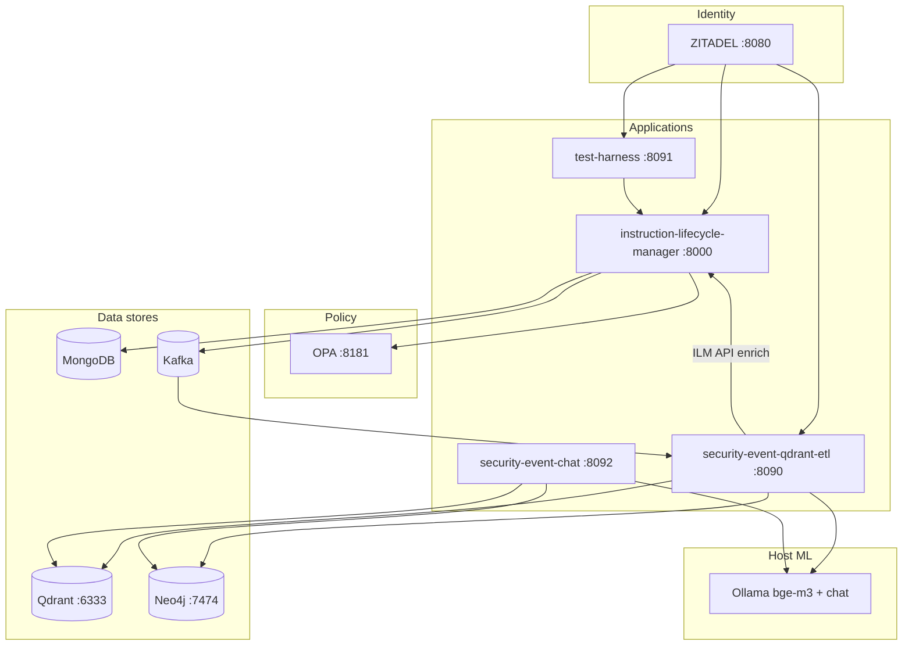

# Security Event RAG Demo

A monorepo that captures security-relevant business events from SSI instruction lifecycle, streams them through Kafka, indexes them in Qdrant and Neo4j, and answers natural-language questions over that history.

Example questions:

- Who created the instruction that Mike rejected?
- How many instructions were created today?
- How many ALERT events today for international instructions?
- Are there instructions created today still waiting for approval?

## Architecture



## UI and service map

| URL | Service | Purpose |
|-----|---------|---------|
| http://localhost:8000/ui/ | ILM | Instruction browser (read-only) |
| http://localhost:8000/ui/security-events/ | ILM | Live security event monitor |
| http://localhost:8090 | ETL | Search console (vector / BM25 / hybrid / Neo4j) |
| http://localhost:8091 | Test harness | Create / submit / approve instructions |
| http://localhost:8092 | Chat | Natural-language Q&A (vector + BM25 + Neo4j + Ollama) |
| http://localhost:7474/browser/ | Neo4j | Graph browser (`neo4j` / `devpassword`) |
| http://localhost:8080 | ZITADEL | Identity (demo users, password `Password1!`) |

## Components

| Component | Type | Role |
|-----------|------|------|
| `instruction-lifecycle-manager` | App | SSI route-template lifecycle API, OPA, Kafka security events, UIs |
| `opa-policy-seed` | Policies | Rego policies uploaded to OPA on startup |
| `security-event-qdrant-etl` | App | Kafka ETL → enrich via ILM API → Neo4j + Qdrant |
| `security-event-chat` | App | Triple retrieval RAG chat (vector + BM25 + Cypher) |
| `security-event-test-harness` | App | ZITADEL-authenticated end-to-end test UI |
| `neo4j-graph-model` | Schema | Cypher constraints, indexes, relationship docs |
| `zitadel-seed` | Seed | Demo users for ILM / harness / ETL service account |
| `log-forwarder` | Docker | Optional container log shipping to Kafka |

## Instruction model

An **instruction** is an **SSI settlement route template** (accounts, agent chain, currency, validity, approval) — not a payment message. Payment execution fields (amount, value date, remittance) belong on a future payment service.

## Data flow

1. ILM mutates an instruction → OPA authorize → persist to Mongo → emit security event to Kafka (`instruction-security-events`).
2. ETL consumes the event → fetches **current instruction** from ILM API as service user `etl-reader` → merges event + instruction → writes Neo4j graph + Qdrant hybrid index.
3. Chat queries Qdrant (vector + BM25) and Neo4j (Ollama-generated Cypher) in parallel, merges with RRF, answers with Ollama.

**Loop prevention:** ILM skips security event emission for `etl-reader` (`SECURITY_EVENT_EXCLUDED_USER_IDS`) so enrichment reads do not re-trigger Kafka.

## Quick start

```bash
# Full stack (requires host Ollama for ETL + chat embeddings)
docker compose up -d

# Seed ZITADEL demo users (after first ZITADEL init)
PAT=$(docker exec zitadel-login cat /zitadel/bootstrap/login-client.pat | tr -d '\n')
cd zitadel-seed && ZITADEL_PAT="$PAT" python3 seed.py

# Generate lifecycle traffic
open http://localhost:8091
```

### Reset all data

```bash
docker compose down -v --remove-orphans
docker compose up -d
# re-seed ZITADEL users as above
```

## Local development

```bash
# Search console
cd security-event-qdrant-etl && pip install -e . && security-event-search

# Chat
cd security-event-chat && pip install -e . && security-event-chat

# ILM API
cd instruction-lifecycle-manager && pip install -e . && uvicorn instruction_lifecycle_manager.main:app --reload --port 8000

# Test harness UI
cd security-event-test-harness && pip install -e . && security-event-test-harness-ui
```

## Repository layout

```
.
├── docker-compose.yml
├── instruction-lifecycle-manager/   # ILM API + instruction / security UIs
├── security-event-qdrant-etl/       # Kafka ETL + search console
├── security-event-chat/             # RAG chat
├── security-event-test-harness/     # E2E test UI
├── neo4j-graph-model/               # Graph schema docs + constraints
├── opa-policy-seed/                 # Rego policies
├── zitadel-seed/                    # Identity seed (users.yaml)
└── log-forwarder/                   # Optional log → Kafka
```

Each application directory has its own README.
