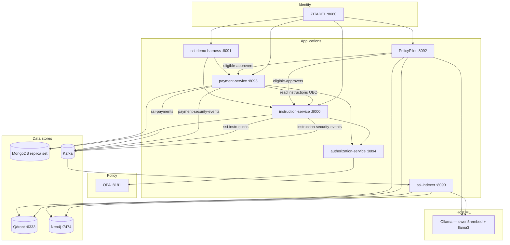
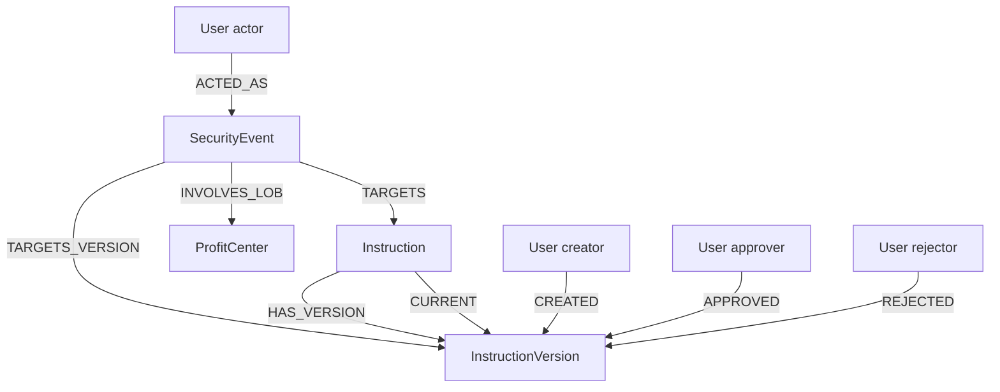
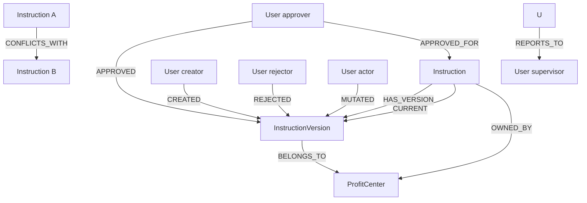
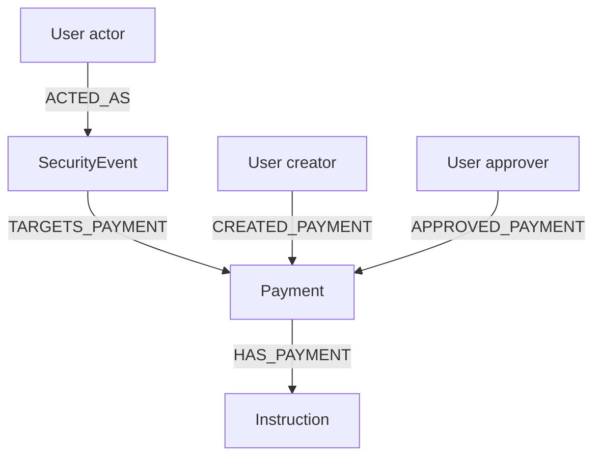

# Security Event RAG Demo

A monorepo demonstrating how to build a **retrieval-augmented generation (RAG) system over financial security events** using a fully local, containerized stack.

The domain is **Security Settlement Instructions (SSI)** and **cash payments** against approved instructions in a capital-markets middle-office context. Every instruction or payment mutation — create, submit, approve, reject, and policy denial — is recorded as a structured security event, streamed through Kafka, indexed into Qdrant and Neo4j, and made queryable via a natural-language chat interface powered by a local Ollama LLM.

## Demo questions

The chat is designed to surface **fraud patterns, compliance violations, and collusion signals** — questions that go beyond what a standard application status screen can answer.

**Collusion and mutual approval:**
- _Are there any instances of approving each other's instructions?_
- _Has any user attempted to approve an instruction they originally created?_

**Inversion of control — segregation of duties:**
- _Are there any instructions approved by someone who reports directly to the creator of the instructions?_

> Banks enforce a hierarchy rule: a subordinate must not approve their manager's instruction. This is an inversion of control violation — the approval authority flows the wrong way up the reporting chain.

**Compliance investigation:**
- _Who created the instruction that Michael Torres rejected?_
- _Who approved instruction `<uuid>`, and why was it allowed?_ (full OPA audit trail — approver, timestamp, policy rationale)
- _Show me all ALERT events for FICC instructions in the last 7 days._
- _Which users triggered the most policy denial alerts this week?_

**Duplicate and conflicting routes:**
- _Are there active instructions sharing the same creditor account and currency — potential duplicate settlement routes?_

**Exact event and instruction lookup:**
- _Can you show me the instruction associated with security event id `<uuid>`?_
- _Can you show me the full lifecycle timeline of instruction `<uuid>`?_

**Payment policy and compliance:**
- _How many payment ALERT events happened today?_
- _Who can approve payment `<uuid>`?_
- _Are there any payments where the approver directly reports to the payment creator?_
- _Show me all APPROVED payments over $10M for FICC this week._

---

## Architecture



### Data flow

1. **Instruction service** — operator creates/mutates an instruction; ZITADEL JWT is validated; the service calls **authorization-service** with On-Behalf-Of (service account `svc-instruction` + user token); authz evaluates OPA and returns `allow` + `allow_basis`; instruction version and security event (with `details.authorization`) are written to MongoDB **in a single transaction**; two Kafka fact events are published — one to `instruction-security-events` (security event + full instruction snapshot) and one to `ssi-instructions` (instruction state fact + authorization on mutations).
2. **Payment service** — middle-office users create payments against approved SSI instructions; the same OBO → authz → OPA path applies; each action writes to MongoDB and publishes to `payment-security-events` (audit) and `ssi-payments` (payment state fact).
3. **Authorization service** — sole runtime caller of OPA. Exposes evaluate and eligible-approvers APIs to domain services only (no MongoDB). Reads candidate approvers from `users.yaml` for batch eligibility checks.
4. **SSI indexer** — runs four independent Kafka consumers, all **self-contained** (full snapshots embedded — no API callbacks). Denormalizes `authorization_summary`, `approved_at`, and related fields onto Qdrant and Neo4j for chat retrieval.
   - **InstructionSecurityEventPipeline** (`instruction-security-events`) → Neo4j + Qdrant `source=instruction_security_event`
   - **InstructionPipeline** (`ssi-instructions`) → instruction master graph + Qdrant `source=instruction_state`
   - **PaymentSecurityEventPipeline** (`payment-security-events`) → payment security graph + Qdrant `source=payment_security_event`
   - **PaymentFactPipeline** (`ssi-payments`) → payment master graph + Qdrant `source=payment_fact`
5. **Chat** — selects a retrieval mode (`events` / `instructions` / `payments` / `all`), runs vector + BM25 + Neo4j in parallel, merges with reciprocal rank fusion. Count, ranking, hierarchy, and approval-by-ID questions use **deterministic planned Cypher** or exact lookups. Instruction approval audit questions return **Who / When** from indexed data and **Why** via LLM rewrite of OPA `authorization_summary`. Live **who can approve?** questions bypass RAG and call instruction-service or payment-service eligible-approvers APIs (compliance JWT). Other questions use full Ollama synthesis.

---

### Why MongoDB for security events?

Security events are **write-heavy, append-only, and schema-flexible**. Different event actions (CREATE, APPROVE, REJECT, VIEW) carry different payloads — a rejection includes a reason, an approval includes the approver's LOB, a VIEW includes a resource path. A fixed relational schema would require either nullable columns for every possible field or a separate table per event type, both of which complicate queries.

MongoDB fits naturally because:

- **Schemaless documents** — each event is stored as-is with no schema migration when new fields are added. New event types or enrichment fields can be introduced without downtime.
- **Long-term retention** — MongoDB's native **TTL indexes** allow per-collection expiry policies. Security events for regulatory audit trails can be retained for years on cheap storage (or tiered to Atlas Online Archive), while transient operational events expire automatically. A single `db.createIndex({"timestamp": 1}, {expireAfterSeconds: N})` declaration governs the lifecycle.
- **Bi-temporal versioning** — instructions are stored as versioned documents (`version_number`, `in`/`out` timestamps). MongoDB's document model stores the entire version as a self-contained snapshot alongside its lifecycle metadata without JOIN complexity.
- **Change Streams** — the ILM's live security-event monitor and the `SecurityEventWatcher` for real-time UI updates both consume MongoDB Change Streams, which provide ordered, resumable change feeds without an external CDC layer.
- **Replica set transactions** — writing an instruction version and its security event in a single ACID multi-document transaction requires a MongoDB replica set, which `docker-compose.yml` initialises automatically as `rs0`.

---

### Why Kafka?

Every instruction mutation produces a **security event** — a structured audit record of who did what to which instruction and when. Kafka decouples the producers of those events (ILM) from every consumer that needs them.

Key reasons:

- **Fan-out with no coupling** — any new consumer (compliance reporting tool, real-time fraud detector, ML feature pipeline, a second ETL feeding a different vector store) can subscribe to the `security-events` topic independently without any change to the ILM. The ILM publishes once; consumers scale independently.
- **Durable replay** — Kafka retains events on disk for a configurable retention window. If the ETL falls behind, restarts, or needs to reprocess a backfill, it can seek back to any offset and replay without touching the ILM.
- **Ordered delivery per partition** — events for the same instruction arrive in order, which matters for the ETL's `CURRENT` relationship management in Neo4j (it only promotes a new version if its `version_number` is higher than the current one).
- **Backpressure isolation** — a spike in instruction activity does not block the ILM. The ETL processes at its own pace; the Kafka topic absorbs the burst.

In this demo Kafka runs as a single broker with no replication, which is appropriate for local development. A production deployment would use a multi-broker cluster with `replication.factor=3` and `min.insync.replicas=2`.

---

### Why ZITADEL?

**What ZITADEL is:** ZITADEL is an open-source cloud-native identity and access management (IAM) platform — think self-hosted Auth0 or Okta. It provides OIDC/OAuth2 authentication, JWT issuance, user management, and metadata storage. In this demo it runs entirely in Docker with no external dependencies.

**How ZITADEL is used:**

Every request to the instruction and payment services carries a ZITADEL-issued JWT Bearer token. Each service validates it against ZITADEL's OIDC discovery endpoint (`/.well-known/openid-configuration`) and extracts the caller's identity — user ID, roles, LOB, and reporting line — from ZITADEL user metadata:

| Metadata key | Meaning | Used for |
|---|---|---|
| `subject_user_id` | Business user ID (`mo-100`, `ficc-300`) | Security events, graph nodes |
| `given_name` / `family_name` | Full name | `display_name` in graph + chat answers |
| `title` | Seniority (Analyst / VP / MD) | OPA approval matrix |
| `roles` | JSON array (`INSTRUCTION_CREATOR`, `INSTRUCTION_APPROVER`) | OPA role check |
| `lob` | Owning profit center (FICC, FX, DESK_*) | OPA LOB ownership check |
| `supervisor_id` | Direct manager's user ID | Inversion-of-control detection in graph |

This metadata is stored in ZITADEL via the `zitadel-seed/seed.py` script, which reads `users.yaml` and calls the ZITADEL admin API to create users and attach metadata. Domain services decode and validate this metadata on every authenticated request.

**Service accounts** (`svc-instruction`, `svc-payment`) authenticate to authorization-service and (for payment) instruction-service using machine tokens. On user-initiated lifecycle calls, the domain service forwards the user's JWT in `X-On-Behalf-Of` so OPA evaluates policy for the real actor, not the service account.

**Why ZITADEL over a simpler alternative:** ZITADEL provides a **user metadata API** that allows arbitrary key-value pairs per user (roles, LOB, supervisor). This means identity attributes that drive authorization policy (LOB ownership, seniority, org hierarchy) live in the identity layer — not hard-coded in the application or duplicated across services. Any service that validates the JWT can read the same canonical user attributes without a separate user-profile API call.

---

### Why OPA?

**What OPA is:** Open Policy Agent is a **policy-as-code** engine. It decouples authorization decisions from application code — the application sends a structured query (`input`) to OPA and receives a boolean decision (allow / deny). Policies are written in **Rego**, a declarative language designed for hierarchical data queries.

**How OPA is used:**

Only **authorization-service** calls OPA at runtime. Domain services build structured policy input and POST to authz; authz forwards to OPA's Data API:

```
instruction-service / payment-service
  → authorization-service  (svc-* token + X-On-Behalf-Of: user JWT)
  → OPA POST /v1/data/{instruction|payment}/lifecycle/allow
```

Example input (built by the domain service, evaluated by authz → OPA):

```json
{
  "input": {
    "action": "APPROVE",
    "subject": { "user_id": "mo-100", "title": "Analyst", "roles": ["INSTRUCTION_CREATOR"], "lob": null },
    "resource": { "instruction_id": "...", "owning_lob": "FICC", "created_by": "mo-100", "status": "PENDING" }
  }
}
```

OPA evaluates the Rego policy bundle and returns `allow` / `deny`. Authorization-service also queries **`allow_basis`**, **`violations`**, and **`is_alert`**. Domain services store the result on every security event as `details.authorization` and copy `authorization.summary` to `event.reason` for authorized actions.

**OPA security in this demo:** OPA listens on `:8181` with no authentication (typical for a local policy sidecar). The trust boundary is **authorization-service**, which requires `svc-instruction` or `svc-payment` bearer tokens. Do not expose OPA to untrusted networks in production — keep it on an internal network reachable only from authz.

Example authorization block on an APPROVE security event:

```json
{
  "engine": "opa",
  "package": "instruction.lifecycle",
  "action": "APPROVE",
  "decision": "allow",
  "allow_basis": [
    "approval matrix: Vice President may approve work by Analyst",
    "approver LOB FICC matches instruction LOB",
    "approver does not report to creator",
    "role INSTRUCTION_APPROVER"
  ],
  "summary": "Vasquez, Elena (ficc-300) was allowed to APPROVE because approval matrix: Vice President may approve work by Analyst; ..."
}
```

**Key policies enforced:**

| Rule | Rego condition | What it catches |
|---|---|---|
| Role gate | `"INSTRUCTION_APPROVER" in subject.roles` | Non-approvers attempting to approve |
| Creator cannot approve | `subject.user_id != resource.created_by` | Self-approval (cross-approval collusion) |
| Subordinate cannot approve | `approver.supervisor_id != creator.user_id` | Manager approving subordinate's instruction (inversion of control) |
| LOB ownership | `subject.lob == resource.owning_lob` | Wrong-desk approval (e.g. FX desk approving FICC instruction) |
| Status gate | `resource.status == "PENDING"` | Approving an instruction not yet submitted |
| Role segregation | `"INSTRUCTION_CREATOR" not in subject.roles` | Middle-office creator accounts cannot approve |

**Why policy-as-code matters for this demo:** Allows and denials both produce structured audit records in Kafka → Neo4j → Qdrant. Denials surface as `ALERT` events for fraud-pattern questions (_"which users triggered the most policy denial alerts?"_). Allows carry `details.authorization` so the chat can answer approval audit questions with **Who / When / Why**, not just a name from instruction state.

**Why OPA over embedding auth in domain services:** Policy logic changes independently of application logic. Adding a new rule (e.g. "MD-level approval required for international wire > $10M") requires editing a `.rego` file and reloading OPA — not rebuilding instruction-service or payment-service. The `opa-policy-seed` container loads policies from the `opa-policy-seed/policies/` directory at startup.

---

### Why Qdrant + BM25 (hybrid search)?

No single retrieval strategy reliably handles the full range of questions a user asks over security events.

**Dense vector search** (via `qwen3-embedding:0.6b` embeddings) excels at **semantic similarity** — "who tried to approve each other's instructions?" or "show me policy denial events for FX desk" — where the meaning matters more than the exact words. But dense search struggles with **exact identifiers**: if the user pastes a UUID like `2f75858d-d845-40d4-b9fb-43951a8c40e2`, the embedding of that string carries little semantic signal and the cosine similarity ranking is unreliable.

**BM25 sparse search** is a classical term-frequency model (the same family as Elasticsearch's default scorer). It excels precisely where dense search fails: **exact-match tokens** — UUIDs, user IDs (`mo-100`, `ficc-300`), action names (`APPROVE`, `REJECT`), currency codes (`USD`, `EUR`). However, BM25 has no concept of synonymy or paraphrase — "declined" and "rejected" are unrelated tokens to BM25.

**Hybrid search** fuses both signals:

```
score_hybrid(doc) = RRF(rank_dense, rank_bm25)
                  = 1/(k + rank_dense) + 1/(k + rank_bm25)
```

Reciprocal Rank Fusion (RRF, Cormack et al. 2009) combines ranked lists without requiring score normalisation. The constant `k=60` dampens the influence of very high ranks. Empirically, hybrid search consistently outperforms either retriever alone in recall@10 across heterogeneous query distributions — a result confirmed in the BEIR benchmark suite and Qdrant's own evaluations.

Qdrant was chosen because it natively supports **named vectors** (one point can carry both a dense 1024-d float32 vector and a BM25 sparse vector), runs hybrid queries server-side, and exposes a clean async Python client. The BM25 sparse encoder (`qdrant/bm25`) runs inside Qdrant itself — no separate sparse-encoder service is needed.

---

### Why Neo4j (knowledge graph)?

The fundamental limitation of vector + BM25 retrieval is that it operates over **flat document similarity**. Each enriched security event is an independent point in the index. Relationships between events — "this approval was done by the same person who created the other instruction", "these two instructions share a creditor account and currency, suggesting a duplicate route" — are **invisible** to a retriever that ranks documents one at a time.

A **knowledge graph** makes those relationships first-class queryable citizens:

```
(User ficc-300)-[:APPROVED]->(InstructionVersion v2)
(User mo-100)-[:CREATED]->(InstructionVersion v2)
(User ficc-300)-[:APPROVED_FOR]->(User mo-100)   ← cross-approval edge
```

The graph enables questions that are **structurally impossible** with flat retrieval alone:

| Question | Why flat retrieval fails | How Neo4j answers it |
|---|---|---|
| Are there users who approved each other's instructions? | Would require joining two separate query results and checking for symmetry | `MATCH (a)-[:APPROVED_FOR]->(b), (b)-[:APPROVED_FOR]->(a)` |
| What is the full lifecycle timeline of instruction X? | Each event is a separate document — reassembling order requires post-processing | `MATCH (e)-[:TARGETS]->(i) ORDER BY e.timestamp` |
| Which instructions share the same creditor account? | No link exists between documents for separate instructions | `MATCH (v1)-[:CONFLICTS_WITH]->(v2)` |
| Who are all the users in the FICC profit center? | Would need keyword search on `lob=FICC` and hope the field is indexed | `MATCH (u)-[:BELONGS_TO]->(p:ProfitCenter {lob: 'FICC'})` |

**Role in improving RAG recall:**

The chat pipeline asks Ollama to generate a Cypher query for every user question. That query runs against Neo4j and returns structured rows (event IDs, user IDs, instruction IDs, timestamps). Those rows are injected into the LLM context alongside the vector and BM25 results. The LLM then synthesises an answer that combines semantic context (from vector search) with precise relational facts (from the graph). Neither source alone would produce a complete, accurate answer for relationship-heavy questions.

The graph also serves as a **cross-validation layer**: if a UUID is present in the question, the pipeline runs a deterministic Cypher lookup (`MATCH (e:SecurityEvent {event_id: $id})-[:TARGETS_VERSION]->(v)`) that is guaranteed to be exact regardless of embedding similarity.

---

### Why Ollama? Why run it on the host?

**What Ollama is:** Ollama is an open-source LLM serving runtime that packages model weights, quantisation, and an HTTP API (`/api/embed`, `/api/chat`) into a single binary. It supports Metal (Apple GPU), CUDA (NVIDIA GPU), and CPU backends and exposes an OpenAI-compatible interface.

**Why run Ollama on the host, not in Docker:** Docker on macOS runs containers inside a Linux VM (via Apple Hypervisor Framework). That VM has **no visibility into the host GPU** — neither Metal nor MPS (Metal Performance Shaders) is accessible from within a Docker container on macOS. Running `ollama` natively on the host means it can use the Apple M1 Max GPU directly via Metal, achieving 4–8× the inference throughput of CPU-only mode. The containers reach the host Ollama instance via `host.docker.internal:11434`.

**Model selection — embedding:**

| Model | Dim | Context | Strengths | Why not used here |
|---|---|---|---|---|
| `qwen3-embedding:0.6b` ✓ | 1024 | 32 768 | Excellent retrieval, long context | — |
| `snowflake-arctic-embed:m` | 768 | 512 | Compact English retrieval | Prior default; 512-token clipping risk |
| `nomic-embed-text` | 768 | 8192 | Fast, good English recall | Lower retrieval vs Qwen3 embed |
| `bge-m3:latest` | 1024 | 8192 | Multilingual, hybrid modes | Heavier; redundant with Qdrant BM25 |
| `mxbai-embed-large` | 1024 | 512 | Strong English MTEB scores | Very short context window |
| `text-embedding-3-small` (OpenAI) | 1536 | 8191 | High quality | Requires API key, not local |

`qwen3-embedding:0.6b` is the default embedding model — **1024-dimensional** dense vectors indexed in Qdrant alongside BM25 sparse retrieval. After changing embedding models, wipe Qdrant and re-seed so the collection is recreated with the new vector size.

**Model selection — LLM (Cypher generation + answer synthesis):**

| Model | Params | Context | Cypher quality | Notes |
|---|---|---|---|---|
| `llama3:8b` ✓ | 8B | 8 192 | Good | Default chat/Cypher model (quantised via Ollama) |
| `llama3:70b` | 70B | 8 192 | Excellent | Higher quality; needs more RAM/GPU |
| `qwen3:30b` | 30B | 32 768 | Excellent | Prior default; smaller footprint |
| `llama3.1:8b` | 8B | 128 000 | Good | Fast, lower quality Cypher for multi-hop queries |
| `mistral:7b` | 7B | 32 768 | Fair | Tends to hallucinate relationship directions |
| `codellama:13b` | 13B | 16 384 | Good | Strong on code but weaker on natural-language synthesis |
| `gemma3:27b` | 27B | 128 000 | Very good | Competitive mid-size alternative |

`llama3:8b` is the default for PolicyPilot answer synthesis and Cypher generation. Ensure the model is pulled locally before starting the stack (`ollama pull llama3:8b`).

> To swap models: copy `.env.example` to `.env` and set `OLLAMA_CHAT_MODEL` / `OLLAMA_EMBEDDING_MODEL`, then re-pull via `ollama pull`.

---

### Test hardware

All models and benchmarks in this demo were run on the following hardware:

| Component | Specification |
|---|---|
| Chip | Apple M1 Max |
| Unified RAM | 64 GB |
| GPU cores | 32 (built-in, Metal 3) |
| GPU vendor | Apple (0x106b) |
| GPU bus | Built-in (unified memory — no PCIe transfer overhead) |
| Metal support | Metal 3 |

The unified memory architecture means the CPU, GPU, and Neural Engine share the same 64 GB pool with no PCIe copy overhead between host and device memory. The default `llama3:8b` chat model runs comfortably on this hardware; use `llama3:70b` only if you have enough RAM/GPU headroom.

Embedding throughput with `qwen3-embedding:0.6b` is sufficient for real-time ETL indexing at demo event rates, with a 32K-token context window that avoids clipping typical security-event `search_text`.

---

## Services

| URL | Service | Purpose |
|-----|---------|---------|
| http://localhost:8000/ui/ | ILM | Instruction browser |
| http://localhost:8000/ui/security-events/ | ILM | Live security event monitor (SSE) |
| http://localhost:8093/ui/ | Payment service | Payment browser |
| http://localhost:8093/ui/security-events/ | Payment service | Live payment security event monitor (SSE) |
| http://localhost:8000/docs | ILM | OpenAPI |
| http://localhost:8090 | SSI indexer | Search console — vector / BM25 / hybrid / Neo4j |
| http://localhost:8091 | Demo harness | Generate instruction + payment lifecycle traffic |
| http://localhost:8092 | SSI chat | Natural-language Q&A (four search modes) |
| http://localhost:8094 | Authorization service | OPA evaluation API (service accounts) + user directory UI |
| http://localhost:8094/ui/ | Authorization service | Read-only user directory (roles, groups, LOBs, managers) |
| http://localhost:7474/browser/ | Neo4j | Graph browser — `neo4j` / `devpassword` |
| http://localhost:8080/ui/console | ZITADEL | Identity admin console |

---

## Components

| Directory | Role |
|-----------|------|
| `instruction-service` | FastAPI lifecycle API — routes policy checks to authorization-service (OBO), `details.authorization` audit block, Mongo persistence, Kafka publishing, compliance eligible-approvers API |
| `payment-service` | Cash payment lifecycle against approved SSI instructions — same authz/OBO pattern, Mongo persistence, Kafka publishing, payment and security event UIs, compliance eligible-approvers API |
| `ssi-indexer` | Four Kafka consumers — instruction + payment security events and state facts → Neo4j graph writer + Qdrant hybrid indexer (`ssi_search_index`) + search console UI |
| `ssi-chat` | **PolicyPilot** — RAG chat assistant; four search modes, triple retrieval, Who/When/Why approval audit (deterministic facts + LLM WHY rewrite), planned Cypher, regression suite; compliance sign-in for live **who can approve?** via payment-service and instruction-service |
| `authorization-service` | Stateless OPA gateway — lifecycle evaluate + batch eligible-approvers; user directory UI; reads `users.yaml`; no database |
| `ssi-demo-harness` | ZITADEL-authenticated UI to drive lifecycles and OPA policy scenarios |
| `neo4j-graph-model` | Graph schema docs, Cypher constraints/indexes, example queries |
| `opa-policy-seed` | Rego policies — `instruction/` + `payment/` packages with `allow_basis`, `violations`, lifecycle rules |
| `zitadel-seed` | Demo user seed (`users.yaml`) — middle office, FICC/FX/DESK approvers, payment creators/approvers, front-office submitters, compliance analysts (`comp-001`, `comp-002`), service accounts |
| `log-forwarder` | Optional container log shipping to Kafka |

---

## Models

### Embedding model — `qwen3-embedding:0.6b`

The ETL and Chat use [Qwen3-Embedding-0.6B](https://huggingface.co/Qwen/Qwen3-Embedding-0.6B) served via Ollama for dense vector embeddings.

| Property | Value |
|----------|-------|
| Model | `qwen3-embedding:0.6b` |
| Provider | Alibaba (Qwen) |
| Output dimension | **1024** float32 |
| Context window | 32 768 tokens |
| Strengths | Strong retrieval quality, long context for OPA authorization summaries |

Embeddings are queried through `POST /api/embed` on the local Ollama instance. Each document is embedded at write time by the ETL and at query time by PolicyPilot for similarity search.

> **Important:** changing the embedding model changes the Qdrant dense vector size. Run `./ssi-demo-harness/seed-demo-data.sh` (full reset) after switching models.

### Sparse retrieval — `qdrant/bm25`

Alongside dense vectors, both the ETL indexer and Chat retriever use Qdrant's built-in **BM25** sparse encoder (`qdrant/bm25`). BM25 is a classical term-frequency retrieval model — it complements dense semantic search by excelling at exact-match terms like UUIDs, user IDs (`mo-100`, `ficc-300`), and action names (`APPROVE`, `REJECT`).

### Chat / answer model — `llama3:8b`

The LLM used for Cypher generation and answer synthesis is **Llama 3 8B** served via Ollama.

| Property | Value |
|----------|-------|
| Model | `llama3:8b` (default, configurable via `OLLAMA_CHAT_MODEL` in `.env`) |
| Provider | Meta |
| Parameters | 8B |
| Strengths | Fast inference, structured output (Cypher), natural-language synthesis |

The model is called twice per user question (or three times for instruction approval audit questions — see below):
1. **Cypher generation** — mode-specific system prompt + schema + question → a read-only Neo4j Cypher query
2. **Answer synthesis** — mode-specific system prompt + retrieved context → a natural-language answer with event IDs, actors, and LOB attribution
3. **Authorization WHY summarization** (Instructions mode, approval-audit questions only) — rewrites the OPA `authorization_summary` into 2–4 readable sentences while preserving every material policy check; WHO and WHEN remain deterministic from indexed data

Both calls are made via `POST /api/chat` on the local Ollama instance with `stream: false`.

> To use a different chat model: set `OLLAMA_CHAT_MODEL=qwen3:30b` in `.env` (or export it) and re-pull via `ollama pull`.

---

## Prerequisites

| Requirement | Notes |
|-------------|-------|
| Docker + Docker Compose | All containers are defined in `docker-compose.yml` |
| [Ollama](https://ollama.com) running on the host | Needed by ETL and Chat; containers reach it via `host.docker.internal:11434` |
| `qwen3-embedding:0.6b` model pulled | `ollama pull qwen3-embedding:0.6b` |
| Chat model pulled | Default: `llama3:8b` — `ollama pull llama3:8b` |

---

## Quick start

```bash
# 0. Optional: configure Ollama models (defaults work out of the box)
cp .env.example .env

# 1. Pull Ollama models on the host
ollama pull qwen3-embedding:0.6b
ollama pull llama3:8b

# 2. Start the full stack
docker compose up -d

# 3. Seed demo users (after ZITADEL has initialised — ~30 s)
PAT=$(docker exec zitadel-login cat /zitadel/bootstrap/login-client.pat | tr -d '\n')
cd zitadel-seed && ZITADEL_PAT="$PAT" python3 seed.py

# 4. Open the test harness — run instruction and payment policy scenarios
open http://localhost:8091

# 5. Open the chat and start asking questions (try Security Events mode first)
open http://localhost:8092
```

### Reset everything

```bash
docker compose down -v --remove-orphans
docker compose up -d
# re-seed ZITADEL users as above
```

---

## Demo users

All passwords are `Password1!`. Login names follow `{user_id}@ssi.local`.

| User | Name | Role | LOB |
|------|------|------|-----|
| `mo-100` | Sarah Chen | Analyst — middle office creator | — |
| `mo-101` | James Patel | Analyst — middle office creator | — |
| `mo-050` | David Okonkwo | VP — middle office creator | — |
| `mo-010` | Patricia Walsh | MD — middle office creator | — |
| `ficc-201` | Michael Torres | Associate — approver | FICC |
| `ficc-300` | Elena Vasquez | VP — approver | FICC |
| `ficc-400` | Robert Kim | MD — approver | FICC |
| `ficc-500` | Caroline Nguyen | Partner — approver | FICC |
| `fx-201` | Amira Hassan | Associate — approver | FX |
| `fx-300` | Lucas Berger | VP — approver | FX |
| `rates-201` | Nina Johansson | Associate — approver | DESK_RATES |
| `pay-101` | Emily Rodriguez | Analyst — payment creator | FICC, FX |
| `pay-201` | Sophie Laurent | VP — funding approver | FICC, FX |
| `fo-ficc-101` | Alex Morrison | Analyst — front-office submitter | FICC |
| `fo-fx-101` | Jordan Blake | Analyst — front-office submitter | FX |
| `etl-reader` | — | Service account — excluded from security event emission (`SECURITY_EVENT_EXCLUDED_USER_IDS`) | — |
| `svc-instruction` | — | Service account — instruction service → authorization-service (OBO) | — |
| `svc-payment` | — | Service account — payment service → authorization-service and ILM (OBO) | — |
| `admin-001` | Platform Administrator | **Platform admin** — secured UIs (harness, browsers, ETL console, user directory) and **PolicyPilot** | — |
| `comp-001` / `comp-002` | Compliance analysts | **PolicyPilot** and live eligible-approvers questions (via domain services) | — |

**Platform admin (`admin-001`)** — sign in at any secured admin UI (test harness, instruction browser, payment browser, ETL indexer, authorization user directory) and at **PolicyPilot** (`http://localhost:8092`). Requires `PLATFORM_ADMIN` role and `ADMIN` group. All `/api/ui/*` and harness `/api/*` routes require this login; chat and domain-service eligible-approvers APIs accept `PLATFORM_ADMIN` in addition to compliance roles. Business lifecycle APIs still use their respective seeded users via ZITADEL JWT.

After changing `users.yaml`, re-seed Zitadel (`zitadel-seed` container or manual seed script).

See `zitadel-seed/users.yaml` for the full payment user roster (`pay-102` … `pay-400`, amount-limit clubs, and dual-role holders).

---

## Instruction model

An **instruction** is an **SSI settlement route template** — accounts, agent chain, currency, and validity. It is **not** a payment message; no amount, value date, or remittance information lives here.

```
instruction_type    STANDING | SINGLE_USE
wire_scope          DOMESTIC | INTERNATIONAL
currency            ISO 4217 (e.g. USD, EUR)
funding_account     source account
debtor / creditor   legal entities
*_agent             bank chain (ABA / BIC / CHIPS)
effective_date      template validity start
end_date            template validity end
```

Lifecycle: `DRAFT` → `PENDING` → `STANDING | SINGLE_USE` or `REJECTED` → `SUSPENDED` → reactivated or `USED`.

---

## Payment model

A **payment** is a cash transfer request against an approved SSI instruction. Middle-office users create payments; front-office desk users submit them; funding approvers approve or reject.

```
instruction_id      linked SSI route (must be STANDING or SINGLE_USE)
amount              payment amount (USD in demo)
currency            ISO 4217
value_date          settlement date
owning_lob          inherited from instruction
```

Lifecycle: `DRAFT` → `SUBMITTED` → `APPROVED` or `REJECTED` (or `CANCELLED` if the instruction becomes invalid at approval time).

Policy denials (self-approval, wrong LOB, amount over club limit, subordinate approver) emit `ALERT` security events; authorized actions emit `INFO`.

---

## Storage and topic names

| Layer | Name | Purpose |
|-------|------|---------|
| Qdrant collection | `ssi_search_index` | Hybrid search index (dense + BM25) |
| Qdrant payload `source` | `instruction_security_event`, `instruction_state`, `payment_security_event`, `payment_fact` | Point type filter for chat modes |
| MongoDB | `ssi_cash_instructions.instructions` | Instruction versions |
| MongoDB | `ssi_cash_activities.payments` | Payment records |
| MongoDB | `security_events.instruction-service` | ILM security events |
| MongoDB | `security_events.payment-service` | Payment security events |
| Kafka | `instruction-security-events` | ILM security event facts |
| Kafka | `ssi-instructions` | ILM instruction state facts |
| Kafka | `payment-security-events` | Payment security event facts |
| Kafka | `ssi-payments` | Payment state facts |

---

## Neo4j graph model

Four ETL pipelines write to the **same Neo4j database**, producing complementary sub-graphs that share nodes (`Instruction`, `InstructionVersion`, `User`, `ProfitCenter`, `Payment`, `SecurityEvent`).

### Graph 1 — Instruction Security Event Graph
Built by `InstructionSecurityEventPipeline` from the `instruction-security-events` topic.
Answers: _who triggered this event, what severity, what instruction was touched, which actor caused a policy denial?_



### Graph 2 — Instruction Master Graph
Built by `InstructionPipeline` from the `ssi-instructions` topic.
Answers: _what is the current state of an instruction, who approved it, are there duplicate settlement routes, did a subordinate approve their manager's instruction?_



### Graph 3 — Payment Security Event Graph
Built by `PaymentSecurityEventPipeline` from the `payment-security-events` topic.
Answers: _who attempted a denied payment action, what amount/LOB was involved?_



### Graph 4 — Payment Master Graph
Built by `PaymentFactPipeline` from the `ssi-payments` topic.
Answers: _what is the current payment status, who created/submitted/approved it, which instruction does it use?_

The `REPORTS_TO` relationship (org hierarchy from ZITADEL `supervisor_id`) is written by the ETL on every user upsert and powers inversion-of-control queries in chat.

The `CURRENT` relationship is **version-aware** — it only advances forward and is never overwritten by an older version arriving out of order.

Because the graphs share nodes, cross-graph queries work naturally:

```cypher
-- ALERT event actor + current instruction state in one query
MATCH (actor:User)-[:ACTED_AS]->(e:SecurityEvent {severity: 'ALERT'})
MATCH (e)-[:TARGETS_VERSION]->(v:InstructionVersion)
MATCH (i:Instruction {instruction_id: v.instruction_id})-[:CURRENT]->(cv:InstructionVersion)
RETURN actor.display_name, e.message, cv.status, cv.owning_lob
ORDER BY e.timestamp DESC LIMIT 20;

-- Full lifecycle timeline of an instruction (from instruction master graph)
MATCH (i:Instruction {instruction_id: $uuid})-[:HAS_VERSION]->(v:InstructionVersion)
OPTIONAL MATCH (actor:User)-[:MUTATED]->(v)
RETURN v.version_number, v.action, v.status, v.timestamp,
       coalesce(actor.display_name, actor.user_id) AS actor
ORDER BY v.version_number ASC LIMIT 50;

-- Mutual approval (collusion signal)
MATCH (a:User)-[:APPROVED]->(va:InstructionVersion)<-[:CREATED]-(b:User)
MATCH (b)-[:APPROVED]->(vb:InstructionVersion)<-[:CREATED]-(a)
WHERE a.user_id <> b.user_id
RETURN a.display_name AS user_a, b.display_name AS user_b,
       va.instruction_id AS approved_by_a, vb.instruction_id AS approved_by_b;

-- Subordinate approved supervisor's instruction (inversion of control)
MATCH (creator:User)-[:CREATED]->(v:InstructionVersion)
MATCH (approver:User)-[:APPROVED]->(v)
MATCH (approver)-[:REPORTS_TO]->(creator)
RETURN creator.display_name AS creator, approver.display_name AS approver,
       v.instruction_id, v.owning_lob
LIMIT 50;

-- Payment approver reports to payment creator
MATCH (creator:User)-[:CREATED_PAYMENT]->(p:Payment)
MATCH (approver:User)-[:APPROVED_PAYMENT]->(p)
MATCH (approver)-[:REPORTS_TO]->(creator)
RETURN creator.display_name, approver.display_name, p.payment_id, p.amount
LIMIT 50;

-- Potential duplicate settlement routes
MATCH (i1:Instruction)-[:CONFLICTS_WITH]->(i2:Instruction)
MATCH (i1)-[:CURRENT]->(v1:InstructionVersion)
MATCH (i2)-[:CURRENT]->(v2:InstructionVersion)
RETURN v1.instruction_id, v1.creditor_account, v1.currency, v2.instruction_id
LIMIT 50;
```

See `neo4j-graph-model/` for the full property catalog and schema.

---

## RAG pipeline detail

```
User question + search mode (events | instructions | payments | all)
│
├─ Count / ranking / hierarchy question? ──► Planned Cypher (deterministic, Neo4j authoritative)
│
├─ Instructions mode + UUID + "who approved"? ──► Exact instruction lookup + APPROVE event fetch
│                                              └─► Who/When from graph; Why via OPA summary + LLM rewrite
│
├─ UUID detected? ──► Exact Qdrant fetch + fixed Neo4j lookup (pinned to top of context)
│
├─► Qdrant dense vector search (qwen3-embedding:0.6b), filtered by mode
├─► Qdrant BM25 sparse search, filtered by mode
└─► Ollama → Cypher → Neo4j (mode-specific system prompt)
         │
         ▼
    RRF merge (k=60) + dedupe by event_id / payment_id
         │
         ▼
    Ollama answer synthesis (or structured Who/When/Why for approval audit)
```

| Chat mode | Qdrant filter | Neo4j focus |
|-----------|---------------|-------------|
| `events` | `instruction_security_event` + `payment_security_event` | Both security event graphs |
| `instructions` | `instruction_state` | Instruction master graph |
| `payments` | `payment_fact` | Payment master graph |
| `all` | no filter | All entity types |

The chat API response includes the generated Cypher query, graph rows, per-source timing, and source cards tagged `vector` / `bm25` / `neo4j` / `exact`.

---

## Authorization audit trail (Who / When / Why)

Every authorized instruction or payment mutation stores an OPA **authorization block** on the security event:

| Field | Purpose |
|-------|---------|
| `details.authorization.summary` | Human-readable allow/deny sentence |
| `details.authorization.allow_basis` | List of policy checks that passed (allows only) |
| `details.authorization.violations` | Named violation codes (denials) |
| `details.authorization.subject_at_decision` | Actor snapshot at decision time |
| `event.reason` | Copy of `summary` on successful actions |

The ETL denormalizes these onto Qdrant (`authorization_summary`, `authorization_basis`, `approved_at` on `instruction_state`) and Neo4j (`InstructionVersion.approved_at`, `authorization_summary`, `authorization_basis`).

**Chat behaviour (Instructions mode, approval questions):**

| Part | Source | Method |
|------|--------|--------|
| **WHO** | `approver_display` / graph | Deterministic |
| **WHEN** | `approved_at` / event timestamp | Deterministic |
| **WHY** | OPA `authorization_summary` + `allow_basis` | LLM rewrite into readable prose (falls back to raw summary if Ollama fails) |

**Chat behaviour (live policy — who can approve this payment?):**

Compliance analysts sign in at http://localhost:8092 (`comp-001` / `comp-002`, password `Password1!`). Questions like _"Who can approve payment &lt;payment-id&gt;?"_ bypass RAG and call **payment-service** (`POST /api/v1/payments/{id}/eligible-approvers`), which loads the payment, fetches backing instruction context from instruction-service, and delegates OPA batch evaluation to authorization-service. Instruction eligibility questions call **instruction-service** (`POST /api/v1/instructions/{id}/eligible-approvers`) the same way.

---

## Transactional consistency

Every instruction mutation (create, update, submit, approve, reject, suspend, reactivate, use, delete) writes:

- the instruction version to `ssi_cash_instructions.instructions`
- the matching security event to `security_events.instruction-service`

Every payment mutation (create, submit, approve, reject) writes:

- the payment record to `ssi_cash_activities.payments`
- the matching security event to `security_events.payment-service`

in a **single MongoDB multi-document transaction** per service. Kafka publish happens only after the transaction commits. MongoDB must run as a replica set — `docker-compose.yml` initialises `rs0` automatically.

---

## Local development

```bash
# ILM API
cd instruction-service && pip install -e .
uvicorn inst.main:app --reload --port 8000

# SSI indexer + search console
cd ssi-indexer && pip install -e .
ssi-indexer           # :8090

# SSI chat
cd ssi-chat && pip install -e .
ssi-chat              # PolicyPilot :8092

# Authorization service
cd authorization-service && pip install -e .
authorization-service           # :8094

# Payment service
cd payment-service && pip install -e .
payment-service                 # :8093

# Demo harness
cd ssi-demo-harness && pip install -e .
ssi-demo-harness-ui   # :8091
```

Each service reads configuration from environment variables (see its own README for the full list). Requires local MongoDB, Kafka, Qdrant, Neo4j, OPA, ZITADEL, and Ollama.

---

## Repository layout

```
.
├── docker-compose.yml
├── instruction-service/             # Instruction lifecycle API + UIs
├── payment-service/                 # Payment lifecycle API + UIs
├── authorization-service/           # OPA gateway + user directory UI
├── shared/authz_client/             # HTTP client used by domain services → authz
├── ssi-indexer/                     # Kafka indexer + search console
├── ssi-chat/                        # PolicyPilot — RAG chat + compliance policy Q&A
├── ssi-demo-harness/                # Demo scenario harness UI
├── neo4j-graph-model/               # Graph schema and example queries
├── opa-policy-seed/                 # Rego policies
├── zitadel-seed/                    # Demo user definitions
└── log-forwarder/                   # Optional log → Kafka forwarder
```

Each application directory has its own README.

---
