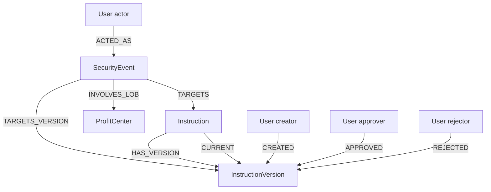

# Neo4j Graph Model

Version-controlled **graph schema and documentation** for security events and instruction lifecycle snapshots.

The ETL (`security-event-qdrant-etl`) applies `schema.cypher` on startup and writes graph data from **enriched security events** (Kafka event + ILM instruction merge).

## Layout

```
schema.cypher         — constraints and indexes (applied by ETL)
relationships.cypher  — node labels, properties, relationships (documentation)
```

## Composite model

Each ETL upsert creates/updates a **star around one SecurityEvent**, linked to the instruction version that existed when the event was indexed:



### Written by ETL today

| Node | Key properties |
|------|----------------|
| `SecurityEvent` | `event_id`, `timestamp`, `severity`, `action`, `outcome`, `message`, `wire_scope`, `instruction_type`, `owning_lob` |
| `Instruction` | `instruction_id` |
| `InstructionVersion` | `version_key`, `status`, `instruction_type`, `wire_scope`, `currency`, `creator_user_id`, `approver_user_id`, `rejector_user_id` |
| `User` | `user_id`, `title`, `lob` |
| `ProfitCenter` | `lob` |

| Relationship | Meaning |
|--------------|---------|
| `ACTED_AS` | Event actor |
| `TARGETS` / `TARGETS_VERSION` | Event → instruction / version |
| `HAS_VERSION` / `CURRENT` | Instruction version history + latest pointer |
| `CREATED` / `APPROVED` / `REJECTED` / `SUBMITTED` | Instruction parties and submitter |
| `INVOLVES_LOB` | Event → profit center |

**Documented but not yet written:** `SUPERSEDES`, `OWNED_BY`, `REPORTS_TO`.

Qdrant holds the **full** merged JSON; Neo4j holds a **traversal-friendly projection**.

## Neo4j Browser

http://localhost:7474/browser/ — login `neo4j` / `devpassword`

## Apply schema manually

```bash
cat schema.cypher | docker exec -i neo4j cypher-shell -u neo4j -p devpassword
```

## Example queries

```cypher
// Instructions created today (count)
MATCH (e:SecurityEvent {action: 'CREATE', outcome: 'success'})
WHERE date(datetime(e.timestamp)) = date()
RETURN count(DISTINCT e) AS total;

// Who created instructions rejected by ficc-201
MATCH (u:User {user_id: 'ficc-201'})-[:ACTED_AS]->(e:SecurityEvent {action: 'REJECT'})
MATCH (e)-[:TARGETS_VERSION]->(v:InstructionVersion)
RETURN e.event_id, v.creator_user_id, v.instruction_id
ORDER BY e.timestamp DESC;

// ALERT events today by wire scope
MATCH (e:SecurityEvent {severity: 'ALERT'})
WHERE date(datetime(e.timestamp)) = date()
RETURN e.wire_scope, count(*) AS alerts;
```

See `relationships.cypher` for the full property catalog.
