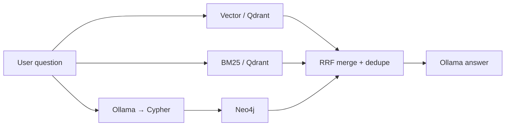

# Security Event Chat

Conversational Q&A over indexed security events. Modeled after
[sec-edgar-filings-chat](https://github.com/sanjuthomas/sec-edgar-filings-chat), but retrieval always runs **vector + BM25 + Neo4j** — no store picker in the UI.

## URL

http://localhost:8092

## RAG pipeline



1. **Vector** — `bge-m3:latest` embed → Qdrant dense search
2. **BM25** — Qdrant sparse lexical search
3. **Neo4j** — Ollama generates read-only Cypher from `neo4j-graph-model/relationships.cypher`
4. **Merge** — reciprocal rank fusion (k=60), dedupe by `event_id`
5. **Answer** — Ollama chat model synthesizes natural language from merged context

The sidebar shows generated Cypher, timing, and source cards tagged `vector` / `bm25` / `neo4j`.

## Example questions

- How many instructions were created today?
- Who created the instruction that Mike rejected?
- How many ALERT events today for international instructions?
- How many standing approvals happened today?

## Configuration (Docker)

| Variable | Default |
|----------|---------|
| `OLLAMA_EMBEDDING_MODEL` | `bge-m3:latest` |
| `OLLAMA_CHAT_MODEL` | `qwen3:30b` |
| `QDRANT_COLLECTION` | `instruction_security_events` |
| `NEO4J_URI` | `bolt://neo4j:7687` |
| `GRAPH_MODEL_DIR` | `/app/neo4j-graph-model` |

Requires Qdrant and Neo4j populated by `security-event-qdrant-etl` and **host Ollama**.

## Run locally

```bash
cd security-event-chat
pip install -e .
security-event-chat
```

## API

```bash
curl -s -X POST http://localhost:8092/api/chat \
  -H 'Content-Type: application/json' \
  -d '{"message":"How many instructions were created today?","history":[]}'
```

| Method | Path | Description |
|--------|------|-------------|
| GET | `/health` | Liveness |
| GET | `/api/status` | Ollama models + Qdrant collection exists |
| POST | `/api/chat` | Ask a question (multi-turn via `history`) |

## Docker

```bash
docker compose up -d security-event-chat
```
