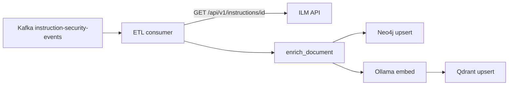

# Security Event Qdrant ETL

Kafka consumer that enriches security events with the **current instruction** from ILM, then indexes the composite into **Qdrant** (dense + BM25) and **Neo4j** (graph projection).

Also exposes a **Search Console** UI for manual vector / BM25 / hybrid / Neo4j queries.

## URL

http://localhost:8090

## Pipeline



For each Kafka message:

1. Parse security event (`actor`, `resource`, `event`, …).
2. Authenticate as **`etl-reader@ssi.local`** (ZITADEL) and fetch current instruction from ILM.
3. Build **`merged`** context (actor + creator/approver/rejector + wire scope, etc.).
4. Upsert Neo4j nodes/relationships (see `neo4j-graph-model/`).
5. Embed `search_text` with Ollama **`bge-m3:latest`** → upsert Qdrant hybrid point.

## Enriched document shape

Stored in Qdrant payload (and used for search text):

| Field | Content |
|-------|---------|
| `security_event` | Full Kafka/Mongo event |
| `instruction` | Full ILM `InstructionResponse` |
| `merged` | Denormalized join (actor, creator, action, wire_scope, …) |
| `search_text` | Flattened string for embedding + BM25 |

## Search Console

| Mode | Backend |
|------|---------|
| Hybrid | Qdrant dense + BM25 → RRF |
| Vector | Qdrant dense only |
| BM25 | Qdrant sparse only |
| Neo4j | Text search on `SecurityEvent` nodes |

Component status bar shows Kafka, Qdrant, Neo4j, and Ollama health.

## Configuration (Docker)

| Variable | Default |
|----------|---------|
| `KAFKA_SECURITY_EVENTS_TOPIC` | `instruction-security-events` |
| `ILM_URL` | `http://instruction-lifecycle-manager:8000` |
| `ETL_READER_LOGIN` | `etl-reader@ssi.local` |
| `OLLAMA_EMBEDDING_MODEL` | `bge-m3:latest` |
| `QDRANT_COLLECTION` | `instruction_security_events` |
| `NEO4J_URI` | `bolt://neo4j:7687` |

Requires **host Ollama** (`OLLAMA_URL=http://host.docker.internal:11434`).

## Run locally

```bash
cd security-event-qdrant-etl
pip install -e .
security-event-search   # serves on :8090
```

## API (selected)

| Method | Path | Description |
|--------|------|-------------|
| GET | `/api/stats` | Component health + Qdrant point counts |
| POST | `/api/search/hybrid` | Hybrid search |
| POST | `/api/search/vector` | Dense vector search |
| POST | `/api/search/bm25` | BM25 search |
| GET | `/api/graph/events` | Neo4j event text search |
| GET | `/api/graph/events/{event_id}` | Event subgraph |

## Reset consumer offsets

If Qdrant/Neo4j are empty but Kafka has messages:

```bash
docker compose stop security-event-qdrant-etl
docker exec kafka /opt/kafka/bin/kafka-consumer-groups.sh \
  --bootstrap-server localhost:9092 \
  --group security-event-qdrant-etl \
  --reset-offsets --to-earliest \
  --topic instruction-security-events --execute
docker compose up -d security-event-qdrant-etl
```
