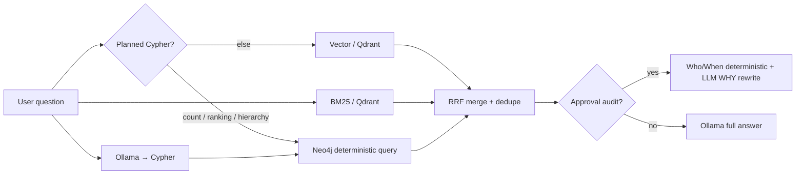

# PolicyPilot (`ssi-chat`)

**PolicyPilot** is the conversational assistant for policy Q&A over indexed security events,
instructions, and payments. Modeled after
[sec-edgar-filings-chat](https://github.com/sanjuthomas/sec-edgar-filings-chat), but retrieval always runs **vector + BM25 + Neo4j** — no store picker in the UI.

## URL

http://localhost:8092

## Search modes

The sidebar radio buttons select what Qdrant and Neo4j focus on:

| Mode | Qdrant filter | Use for |
|------|---------------|---------|
| **Security Events** (`events`) | `instruction_security_event` + `payment_security_event` | Policy denials, audit trail, ALERT/INFO counts |
| **Instructions** (`instructions`) | `instruction_state` | Instruction state, duplicate routes, **Who/When/Why approval audit** |
| **Payments** (`payments`) | `payment_fact` | Payment amounts, statuses, approvers |
| **All entities** (`all`) | no filter | Cross-domain questions |

Pass `"mode"` in the API request body (default `"events"`).

## RAG pipeline



1. **Planned Cypher** — count, ranking, hierarchy, and instruction approval-by-ID questions bypass LLM Cypher generation (Neo4j is authoritative)
2. **Exact lookup** — UUID in question triggers Qdrant fetch by ID; Instructions mode also fetches APPROVE security events for approval questions
3. **Vector** — `qwen3-embedding:0.6b` embed → Qdrant dense search (mode-filtered)
4. **BM25** — Qdrant sparse lexical search (mode-filtered)
5. **Neo4j** — Ollama generates read-only Cypher from mode-specific prompts + `neo4j-graph-model/relationships.cypher`
6. **Merge** — reciprocal rank fusion (k=60), dedupe by `event_id` / `instruction_id`
7. **Answer** — full Ollama synthesis, **or** structured Who/When/Why for instruction and payment approval audit questions

## Who / When / Why (approval audit)

For questions like _"Who approved instruction `<uuid>`?"_ in **Instructions** mode, or _"Who approved payment `<uuid>`?"_ in **Payments** mode:

| Part | Source | Method |
|------|--------|--------|
| **WHO** | `approver_display` from instruction state or graph | Deterministic — no LLM |
| **WHEN** | `approved_at` or APPROVE event timestamp | Deterministic — no LLM |
| **WHY** | `authorization_summary` + `allow_basis` from OPA | **LLM rewrite** into 2–4 readable sentences; preserves all material policy checks; falls back to raw OPA text if Ollama fails |

Example answer shape:

```
WHO: Vasquez, Elena (ficc-300)
WHEN: 2026-06-27T02:48:09.697763
WHY: Elena Vasquez was authorized to approve because her Vice President title satisfies the approval matrix for Analyst work in FICC, her LOB matched the instruction, and there was no reporting relationship between approver and creator. The instruction met duration, role, and valid-transition requirements.
```

Requires indexed `authorization_summary` on instruction state or APPROVE security events (populated automatically on new lifecycle actions).

## Live eligibility (“who can approve?”)

Questions like _“Who can approve payment `<uuid>`?”_ or _“Who can approve instruction `<uuid>`?”_ **bypass RAG** and call domain services directly:

| Question target | API |
|-----------------|-----|
| Payment | `POST http://payment-service:8093/api/v1/payments/{id}/eligible-approvers` |
| Instruction | `POST http://instruction-service:8000/api/v1/instructions/{id}/eligible-approvers` |

Requires **compliance sign-in** at http://localhost:8092 (`comp-001` / `comp-002`, or platform admin). Domain services enforce the compliance JWT, load entity context, and delegate batch OPA evaluation to authorization-service.

## Example questions

See **`regression/questions.yaml`** for the full regression bank (~60 cases) and **`regression/README.md`** for how to run it.

**Security Events mode:**
- How many ALERT events happened today?
- How many payment policy denial alerts happened today?
- Which user triggered the most policy denial alerts this week?

**Instructions mode:**
- Who approved instruction `<uuid>`? (Who / When / Why audit trail)
- Are there any instructions approved by someone who directly reports to the creator?
- Are there active instructions sharing the same creditor account and currency?

**Payments mode:**
- Who approved payment `<uuid>`? (Who / When / Why audit trail with OPA policy basis)
- How many payments were approved today for FICC?
- Show payments over $10M approved this week.

## Configuration (Docker)

Copy `.env.example` to `.env` at the repo root to override defaults. Docker Compose and pydantic-settings both read it.

| Variable | Default |
|----------|---------|
| `OLLAMA_EMBEDDING_MODEL` | `qwen3-embedding:0.6b` |
| `OLLAMA_CHAT_MODEL` | `llama3:8b` |
| `QDRANT_COLLECTION` | `ssi_search_index` |
| `NEO4J_URI` | `bolt://neo4j:7687` |
| `GRAPH_MODEL_DIR` | `/app/neo4j-graph-model` |
| `PAYMENT_SERVICE_URL` | `http://payment-service:8093` |
| `INSTRUCTION_SERVICE_URL` | `http://instruction-service:8000` |
| `OIDC_ISSUER_URL` | `http://localhost:8080` |

Requires Qdrant and Neo4j populated by `ssi-indexer` and **host Ollama**.

## Run locally

```bash
cd ssi-chat
pip install -e .
ssi-chat
```

## API

```bash
curl -s -X POST http://localhost:8092/api/chat \
  -H 'Content-Type: application/json' \
  -d '{"message":"Who approved instruction ID 242cf85e-6ae5-49bb-befb-9141d5053307?","mode":"instructions","history":[]}'
```

| Method | Path | Description |
|--------|------|-------------|
| GET | `/health` | Liveness |
| GET | `/api/status` | Ollama models + Qdrant collection exists |
| POST | `/api/chat` | Ask a question (`mode`, multi-turn via `history`) |

## Docker

```bash
docker compose up -d ssi-chat
```

## Regression suite

```bash
cd ssi-chat
pip install -e ".[regression]"
PYTHONPATH=. python -m regression.runner --seed --report regression-report.json
```

See `regression/README.md` for filters (`--mode`, `--tags`, `--ids`) and CI usage via `RUN_CHAT_REGRESSION=1 pytest`.
