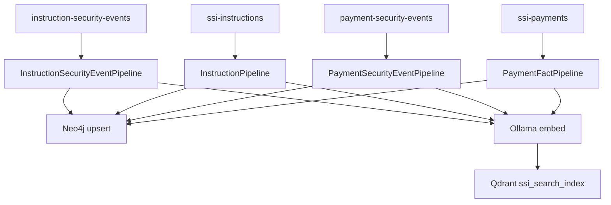

# SSI Indexer

Kafka consumers that index instruction and payment facts into **Qdrant** (dense + BM25 hybrid) and **Neo4j** (graph projection).

Also exposes a **Search Console** UI for manual vector / BM25 / hybrid / Neo4j queries.

## URL

http://localhost:8090

## Pipelines

Four independent consumers run in the same process. Every Kafka message carries a **full snapshot** — the ETL makes no API calls to ILM or the payment service.



| Pipeline | Kafka topic | Consumer group | Qdrant `source` tag |
|----------|-------------|----------------|---------------------|
| `InstructionSecurityEventPipeline` | `instruction-security-events` | `instruction-security-event-etl` | `instruction_security_event` |
| `InstructionPipeline` | `ssi-instructions` | `ssi-instruction-etl` | `instruction_state` |
| `PaymentSecurityEventPipeline` | `payment-security-events` | `payment-security-event-etl` | `payment_security_event` |
| `PaymentFactPipeline` | `ssi-payments` | `payment-fact-etl` | `payment_fact` |

For each message:

1. Parse the fact event (security event or state snapshot).
2. Upsert Neo4j nodes/relationships (see `neo4j-graph-model/`). User upserts also write `REPORTS_TO` from `supervisor_id`.
3. Embed `search_text` with Ollama **`snowflake-arctic-embed:m`** → upsert Qdrant hybrid point.

## Enriched document shape (instruction security events)

Stored in Qdrant payload (and used for search text):

| Field | Content |
|-------|---------|
| `security_event` | Full Kafka/Mongo event (includes `instruction_snapshot`) |
| `instruction` | Instruction snapshot from the event |
| `merged` | Denormalized join (actor, creator, action, wire_scope, …) |
| `search_text` | Flattened string for embedding + BM25 |
| `source` | `instruction_security_event`, `instruction_state`, `payment_security_event`, or `payment_fact` |

### Authorization fields (indexed for chat)

| Pipeline | Extra indexed fields |
|----------|---------------------|
| Instruction security events | `merged.authorization_summary`, `merged.authorization_basis`, `merged.timestamp` |
| Instruction state (`ssi-instructions`) | `approved_at`, `authorization_summary`, `authorization_basis` on Qdrant + Neo4j `InstructionVersion` |
| Payment security events / facts | Same denormalization pattern |

On APPROVE instruction security events, the pipeline **patches** the existing `instruction_state` Qdrant point with approval authorization. Non-APPROVE instruction facts preserve existing approval fields when upserting.

## Search Console

| Mode | Backend |
|------|---------|
| Hybrid | Qdrant dense + BM25 → RRF |
| Vector | Qdrant dense only |
| BM25 | Qdrant sparse only |
| Neo4j | Text search on `SecurityEvent` nodes |

Component status bar shows Kafka, Qdrant, Neo4j, and Ollama health.

## Configuration (Docker)

Copy `.env.example` to `.env` at the repo root to override defaults. Docker Compose and pydantic-settings both read it.

| Variable | Default |
|----------|---------|
| `KAFKA_INSTRUCTION_SECURITY_EVENTS_TOPIC` | `instruction-security-events` |
| `KAFKA_INSTRUCTION_SECURITY_EVENTS_CONSUMER_GROUP` | `instruction-security-event-etl` |
| `KAFKA_INSTRUCTION_TOPIC` | `ssi-instructions` |
| `KAFKA_PAYMENT_SECURITY_EVENTS_TOPIC` | `payment-security-events` |
| `KAFKA_PAYMENTS_TOPIC` | `ssi-payments` |
| `OLLAMA_EMBEDDING_MODEL` | `snowflake-arctic-embed:m` |
| `OLLAMA_CHAT_MODEL` | `llama3:8b` |
| `QDRANT_COLLECTION` | `ssi_search_index` |
| `NEO4J_URI` | `bolt://neo4j:7687` |

Requires **host Ollama** (`OLLAMA_URL=http://host.docker.internal:11434`).

## Run locally

```bash
cd ssi-indexer
pip install -e .
ssi-indexer   # serves on :8090
```

## API (selected)

| Method | Path | Description |
|--------|------|-------------|
| GET | `/api/stats` | Component health + Qdrant point counts |
| POST | `/api/search/hybrid` | Hybrid search |
| POST | `/api/search/vector` | Dense vector search |
| POST | `/api/search/bm25` | BM25 search |
| GET | `/api/graph/events` | Neo4j event text search |
| GET | `/api/graph/events/{event_id}` | Event subgraph |

## Reset consumer offsets

If Qdrant/Neo4j are empty but Kafka has messages, reset each consumer group:

```bash
docker compose stop ssi-indexer

for TOPIC_GROUP in \
  "instruction-security-events:instruction-security-event-etl" \
  "ssi-instructions:ssi-instruction-etl" \
  "payment-security-events:payment-security-event-etl" \
  "ssi-payments:payment-fact-etl"
do
  TOPIC="${TOPIC_GROUP%%:*}"
  GROUP="${TOPIC_GROUP##*:}"
  docker exec kafka /opt/kafka/bin/kafka-consumer-groups.sh \
    --bootstrap-server localhost:9092 \
    --group "$GROUP" \
    --reset-offsets --to-earliest \
    --topic "$TOPIC" --execute
done

docker compose up -d ssi-indexer
```
